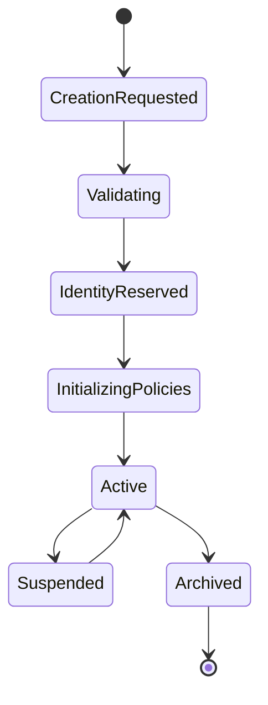
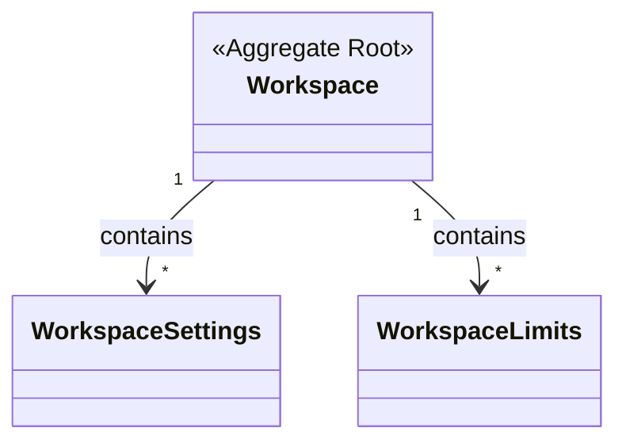

# Aggregate Root: Workspace

## Purpose
`Workspace` es el concepto raíz y de primer nivel de la plataforma RRSS AUTO. Define el límite principal multi-tenant.

## Responsibilities
- Gobernar recursos operativos, credenciales, negocios, automatizaciones y configuraciones a nivel tenant.
- Mantener la consistencia de los datos y políticas dentro de su límite operacional.
- Autorizar acciones basadas en el estado operativo (ej. no permitir operaciones si está suspendido).
- Poseer el ciclo de vida de los negocios asociados (`Business` pertenece conceptualmente al Workspace).

## Lifecycle

## Invariants
- Un Workspace debe tener una identidad única estable (`WorkspaceId`).
- Un Workspace activo puede contener negocios y recursos.
- Un Workspace suspendido no permite iniciar nuevas operaciones productivas.
- Todo recurso operativo debe estar enlazado a un Workspace explícitamente.
- Un Workspace debe tener zona horaria y estado definidos.

## Relationships

*(Nota: Las entidades como Members, Businesses, Credentials son agregados o colecciones administradas independientemente pero siempre ligadas a este Workspace mediante el ID)*.

## Allowed transitions
- `CreationRequested` -> `Active` (tras validaciones iniciales y establecimiento de políticas).
- `Active` -> `Suspended` (por decisión comercial o infracción de reglas).
- `Suspended` -> `Active` (por reactivación).
- `Active` / `Suspended` -> `Archived` (retiro definitivo).
