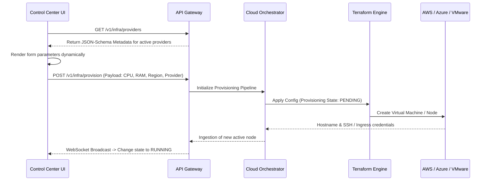
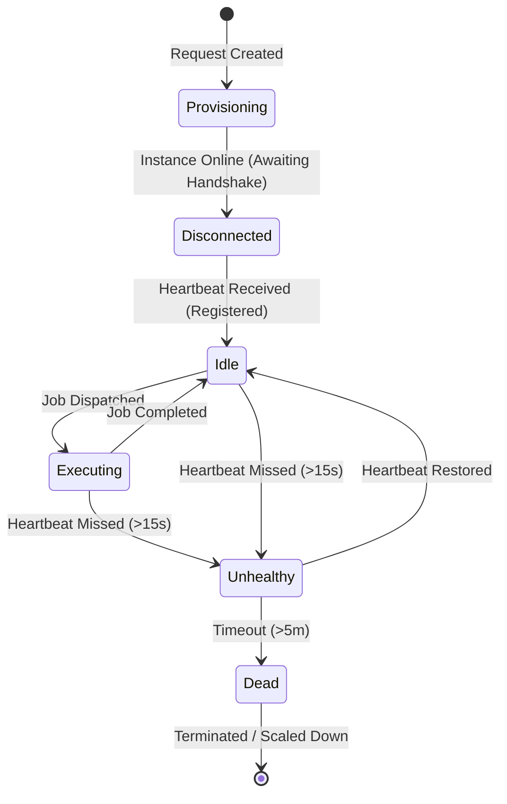
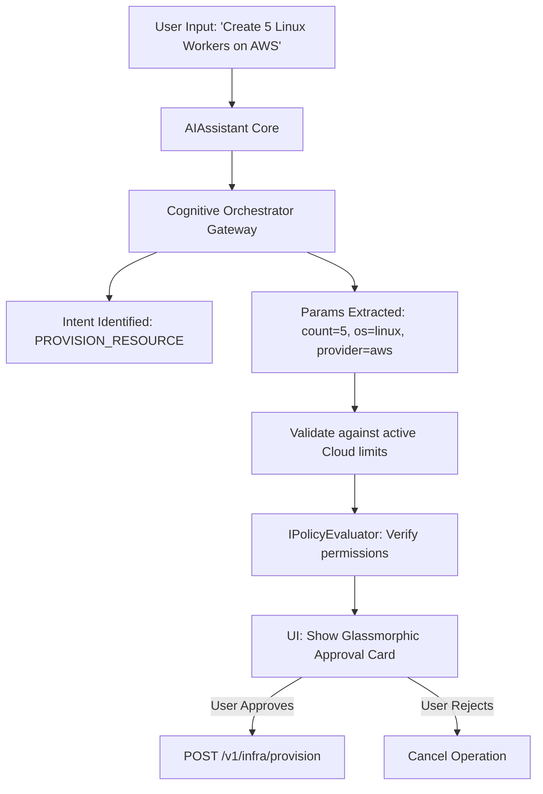
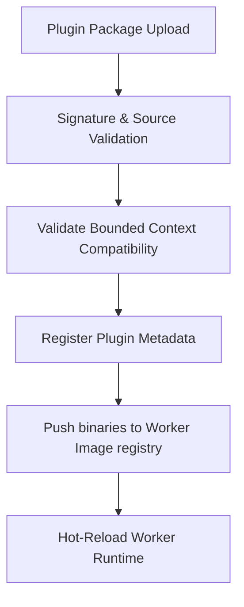

RRSS AUTO: Enterprise Control Center Architecture

This document defines the architectural specifications, visual standards, data lifecycles, and component hierarchies for the **Enterprise Control Center (ECC)**—the primary administrative nd user interface for RRSS AUTO.

---

## 1. Enterprise Control Center Architecture

The Enterprise Control Center is designed as a **Microkernel-driven Single Page Application (SPA)** using React 19, TypeScript, and Vite. The frontend adopts a strict **Hexagonal architecture** to separate business state, rendering templates, and external network infrastructure (APIs and WebSockets).

```
+--------------------------------------------------------------------------------+
|                                RENDER LAYER                                    |
|   +--------------------------+  +----------------------+  +----------------+   |
|   | Glassmorphism Components |  | Command Palette View |  |  AI Chat Pane  |   |
|   +--------------------------+  +----------------------+  +----------------+   |
+--------------------------------------------------------------------------------+
                                         |
                                         v
+--------------------------------------------------------------------------------+
|                           CORE APPLICATION LAYER                               |
|   +--------------------------+  +----------------------+  +----------------+   |
|   |    UIModuleRegistry      |  |   Zustand Telemetry  |  | Dynamic Router |   |
|   |    (Microkernel Host)    |  |     State Store      |  |   Controller   |   |
|   +--------------------------+  +----------------------+  +----------------+   |
+--------------------------------------------------------------------------------+
                                         |
                                         v
+--------------------------------------------------------------------------------+
|                              INFRASTRUCTURE PORTS                              |
|   +--------------------------+  +----------------------+  +----------------+   |
|   |      IHttpClient         |  |   IWebSocketClient   |  |   IAIAgentPort |   |
|   +--------------------------+  +----------------------+  +----------------+   |
+--------------------------------------------------------------------------------+
                                         |
                                         v
+--------------------------------------------------------------------------------+
|                            INFRASTRUCTURE ADAPTERS                             |
|   +--------------------------+  +----------------------+  +----------------+   |
|   |       Axios Client       |  |  WebSocket Channel   |  |  OpenAI / API  |   |
|   |       (REST APIs)        |  |     (Live Stream)    |  |    Gateway     |   |
|   +--------------------------+  +----------------------+  +----------------+   |
+--------------------------------------------------------------------------------+
```

### Key Architectural Guidelines

- **DDD & Bounded Contexts**: The UI is divided into standalone modules matching backend aggregates (Organizations, Workspaces, Workers, Credentials, Plugins, Campaigns).
- **CQRS Mapping**: UI triggers represent Command actions (e.g. `DispatchProvisioningCommand`) or Query actions (e.g. `QueryTelemetry`). State is unidirectional.
- **SOLID Principles**: Views do not directly communicate with API clients. They rely on React hooks (`useWorkers`, `useInfrastructure`) that depend on abstract Zustand stores and services.

---

## 2. Global Navigation Diagram

The primary workspace structure is structured around multi-tenant scoping (Organization -> Workspace -> Views).

```mermaid
graph TD
    Shell[Global Shell Layout]
    Shell --> TopNav[Top Navigation Bar]
    Shell --> Sidebar[Global Sidebar]
    Shell --> Assistant[AI Assistant Drawer]

    TopNav --> OrgSelect[Organization Selector]
    TopNav --> WorkspaceSelect[Workspace Selector]
    TopNav --> Search[Global Search Input]
    TopNav --> NotificationCenter[Notification Center Hub]
    TopNav --> Profile[User Profile & Theme Manager]

    Sidebar --> Dashboard[1. Dashboard Overview]
    Sidebar --> Orgs[2. Organizations & RBAC]
    Sidebar --> Workspaces[3. Workspace Environment]
    Sidebar --> Infra[4. Infrastructure Center]
    Sidebar --> Workers[5. Worker Center]
    Sidebar --> Provisioning[6. Provisioning Engine]
    Sidebar --> Plugins[7. Plugin Manager]
    Sidebar --> Credentials[8. Credential Vault]
    Sidebar --> Automation[9. Automation Workflows]
    Sidebar --> Cloud[10. Cloud Providers]
    Sidebar --> Observability[11. Observability traces]
    Sidebar --> Security[12. Security Audit]
    Sidebar --> Marketplace[13. Marketplace Hub]
    Sidebar --> AIOps[14. AI Operations]
    Sidebar --> Deployment[15. Deployment pipelines]
    Sidebar --> Backup[16. Backup & Recovery]
    Sidebar --> Settings[17. Platform Settings]
```



---

## 3. Module Hierarchy

The directories inside `apps/admin-web/src` separate presentation, domain hooks, state engines, and services.

```
apps/admin-web/src/
├── assets/                 # Brand assets, custom SVGs, global fonts (Outfit)
├── styles/                 # global.css (Tailwind or Custom CSS Custom Properties)
├── core/                   # UIModuleRegistry definitions and system kernel
├── store/                  # Zustand slices for global platform state
│   ├── useUIStore.ts       # Themes, sidebar toggle, open drawers, active routes
│   ├── useAuthStore.ts     # User token, active tenant, active workspace
│   ├── useTelemetryStore.ts# Real-time state of workers, execution logs, CPU streams
│   └── useCommandStore.ts  # Registered action-commands for the Command Palette
├── hooks/                  # Custom react-query / state abstraction hooks
│   ├── useWorkers.ts
│   ├── useInfrastructure.ts
│   └── useSecurityLogs.ts
├── services/               # Adapters to communicate with the RRSS AUTO API
│   ├── HttpAdapter.ts      # Unified REST caller
│   └── WsAdapter.ts        # Real-time WebSocket connection router
└── components/
    ├── layout/             # Sidebar, TopNav, Breadcrumbs, Shell layout, AIAssistant
    ├── common/             # CommandPalette, GlassCard, VirtualList, Spinner
    └── modules/            # The 17 core panels (views, forms, dynamic tables)
```

---

## 4. Infrastructure Management Architecture

Infrastructure provisioning is fully **metadata-driven**. The control center retrieves provider schemas from the api gateway, allowing it to render customization panels without hardcoded HTML code.



---

## 5. Worker Management Architecture

Workers stream live metrics over a WebSockets/SSE adapter. The control center UI utilizes virtualized tables to display thousand-node pools without frame drop.



### Telemetry Mapping

- **Status Ring**: Color coded indicator (`Idle: Green`, `Executing: Blue`, `Unhealthy: Orange`, `Dead: Red`) with a soft glassmorphic pulsing animation.
- **Capabilities Matrix**: Real-time checklist showcasing:
  - Installed Browser Engines (Playwright, Puppeteer, Chrome)
  - Installed Plugins (SAP, Salesforce, Instagram, Google Ads)
  - Memory (allocated vs free) and CPU metrics.

---

## 6. AI Operations Architecture

The AI Assistant is integrated directly as a persistent sidebar overlay panel and keyboard-activated CLI interface.



### Action Confirmation System

To prevent unauthorized AI executions:

1. The AI translates prompts to JSON Actions.
2. The UI intercepts the JSON Action, rendering it as a **Verification Modal**.
3. The operation only proceeds to the API Gateway once the administrator clicks **Confirm Action**.

---

## 7. Plugin Center Architecture

Plugins represent the dynamic engine of RRSS AUTO. The Plugin Center enables administrators to manage plugin lifecycles safely.



- **Hot-swapping**: Workers reload modules at runtime without dropping active execution loops.
- **Rollback Engine**: In case of a crash event, the Control Center triggers a `PATCH /v1/plugins/rollback` command to restore the previous validated SHA index.

---

## 8. Security Center Architecture

The Security Center handles real-time zero-trust validation logs and security policy settings.

- **Zero-Trust Validation Audit**: Display cryptographic signatures (`ExecutionSignature`) validating that every workflow running on workers matches an authorized signature from the orchestrator.
- **Credential Rotation**: Visual timeline showcasing credentials stored in the `ISecretsVault` (AWS KMS / HashiCorp Vault), triggering warning alerts when a secret approaches expiration.
- **Policy Builder**: A visual RBAC policy editor mapping Roles (e.g., `WorkspaceAdmin`, `Developer`, `Auditor`) to resource scopes.

---

## 9. Observability Center Architecture

The Observability Center integrates telemetry data directly with workflow execution histories.

- **Step-by-step Tracing**: Renders the complete workflow execution path, pinpointing where an error occurred (e.g. identifying a database lock or an external API timeout).
- **Execution Replay Viewport**: If an execution fails, the worker uploads the WebP video stream or screenshot trace to safe storage. The Observability viewport matches this recording frame-by-frame with the execution logs for rapid diagnostics.

---

## 10. Deployment Center Architecture

The deployment dashboard displays active deployment topologies:

- **Helm Charts Status**: Monitors Kubernetes pods (`api`, `worker`, `redis`, `postgres`).
- **Terraform State Ingestion**: Highlights active cloud networks, security groups, and cloud instances.
- **Rollback Engine**: Direct triggers to rollback deployments to previous stable commits or Helm revisions.

---

## 11. Marketplace Integration

- **Certified vs Community Assets**: Displays visual tags indicating the source trust level.
- **Automatic Sync**: Periodically pulls available templates, prompts, and plugins from the official RRSS AUTO Hub, allowing administrators to click-to-install items directly to their local organization.

---

## 12. State Management Strategy (Zustand Schema)

The platform state is managed using unified Zustand stores. It leverages modular slices to isolate domains.

```typescript
// useUIStore.ts
export interface UIState {
  theme: "light" | "dark";
  sidebarCollapsed: boolean;
  activeDrawer: string | null;
  toggleTheme: () => void;
  setSidebar: (collapsed: boolean) => void;
}

// useTelemetryStore.ts
export interface TelemetryState {
  workers: Record<string, WorkerTelemetry>;
  activeJobs: Record<string, JobTelemetry>;
  updateWorker: (id: string, stats: WorkerTelemetry) => void;
  removeWorker: (id: string) => void;
}
```

Stores subscribe to the WebSocket service to ingest events on-the-fly and run optimistic UI updates during provisioning and deployments.

---

## 13. UI Architecture Review

- **Glassmorphic Aesthetic Rules**:
  - Backdrop filter: `backdrop-filter: blur(12px) saturate(180%)`.
  - Background color: `rgba(18, 22, 28, 0.7)` for dark mode, `rgba(255, 255, 255, 0.65)` for light mode.
  - Border properties: `1px solid rgba(255, 255, 255, 0.08)` (dark mode) / `1px solid rgba(0, 0, 0, 0.08)` (light mode).
- **Typography & Scale**: Primary fonts: `Outfit`, sans-serif. Baseline grid is `4px` to ensure clean alignment.
- **Performance Rules**: Virtualized scrolling must be used in lists/grids exceeding 50 lines to keep performance at 60 FPS.

---

## 14. Recommendations for Sprint 12.1 – Infrastructure Provisioning Engine

1. **Temporal-Driven Provisioning Orchestration**: Cloud VM provisioning can take minutes and fail mid-execution. Use Temporal workflow states to coordinate provisioning, enabling automatic retries and rollback handlers.
2. **Dynamic Ingress Hooking**: The provisioning engine should automatically register VNC proxy endpoints upon starting desktop sessions or Android emulators, allowing administrators to visually interact with workers directly from the Control Center.
