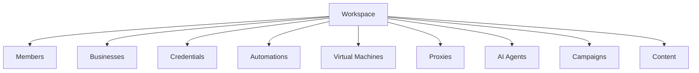
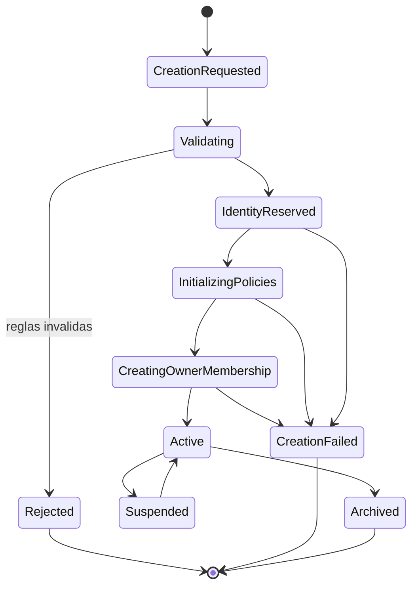
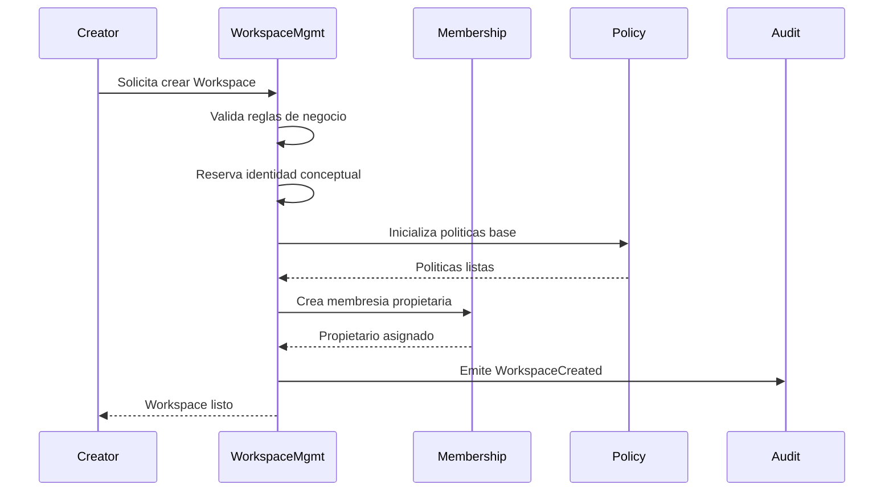
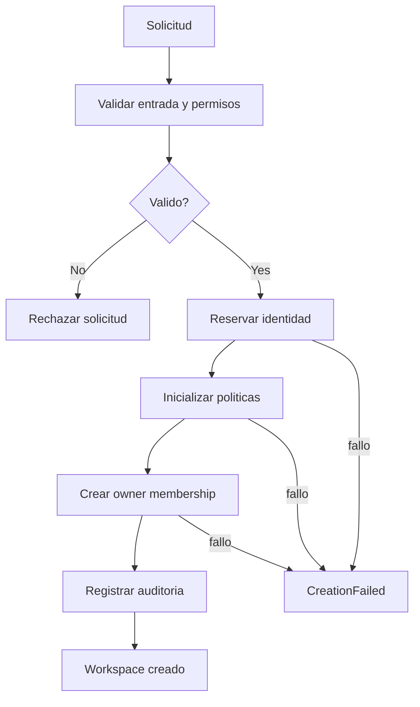

# Blueprint-0001: Create Workspace

## Purpose

Crear un Workspace operativo, aislado y auditable.

Este flujo es el nacimiento del tenant principal de RRSS AUTO. Todo recurso futuro debe pertenecer a este Workspace o relacionarse explicitamente con el.

Decision: crear Workspace es mas importante que crear Business porque Workspace gobierna miembros, negocios, credenciales, automatizaciones, VMs, proxies, agentes IA, campanas y contenido.

## Actors

- Workspace Creator: persona que inicia la creacion.
- Platform Operator: rol interno futuro que puede revisar o asistir.
- Audit & Observability: contexto que registra hechos.
- Workspace Management: contexto propietario del flujo.
- Access & Membership: contexto que crea la membresia inicial.

## User Journey

1. El usuario decide crear un espacio operativo para administrar uno o varios negocios.
2. El usuario entrega informacion minima: nombre, proposito, zona horaria, idioma operativo y datos del propietario inicial.
3. El sistema valida que la solicitud sea coherente y que el creador pueda iniciar un Workspace.
4. El sistema reserva una identidad unica para el Workspace.
5. El sistema crea el Workspace en estado inicial controlado.
6. El sistema crea la membresia del propietario inicial.
7. El sistema inicializa politicas base sin asignar infraestructura real.
8. El sistema emite eventos de auditoria.
9. El usuario queda dentro del Workspace con permisos de propietario.

## Business Rules

- Un Workspace es obligatorio para cualquier recurso de RRSS AUTO.
- Un Workspace debe tener un propietario inicial.
- Un Workspace no debe iniciar con credenciales externas implicitas.
- Un Workspace no debe iniciar con infraestructura asignada automaticamente salvo politica explicita futura.
- Un Workspace debe tener estado.
- Un Workspace debe tener zona horaria operacional.
- El nombre visible puede cambiar; el identificador no.
- La creacion debe ser idempotente desde la perspectiva de solicitud de negocio.
- Si falla la creacion de membresia inicial, el Workspace no debe quedar operativo.
- Si falla auditoria, el resultado debe quedar marcado para reconciliacion.

## Inputs

- Workspace display name.
- Workspace purpose or description.
- Primary timezone.
- Primary locale.
- Creator identity.
- Owner contact.
- Requested plan or operating tier, si existe.
- Idempotency reference, conceptual.

## Outputs

- Workspace identity.
- Workspace status.
- Initial owner membership.
- Base policy set.
- Audit timeline.
- Domain events.

## Preconditions

- El creador esta identificado.
- El creador acepta crear un espacio multi-tenant.
- No se intenta crear un Workspace dentro de otro Workspace.
- La informacion minima esta presente.
- Las reglas de seguridad permiten la accion.

## Postconditions

### Success

- Workspace existe en estado `Active` o `PendingActivation`, segun politica.
- El propietario inicial pertenece al Workspace.
- Las politicas base existen conceptualmente.
- No existe infraestructura asignada por defecto.
- Los eventos de auditoria fueron emitidos.

### Failure

- No debe existir Workspace parcialmente operativo.
- Si existe identidad reservada sin activacion, debe quedar como `CreationFailed` o equivalente conceptual.
- El usuario debe recibir una razon segura, sin exponer detalles internos.

## Ownership Model

Decision: Businesses no poseen infraestructura. Un Business puede usar recursos bajo reglas del Workspace.

## Generated IDs

IDs conceptuales generados:

- WorkspaceId;
- MembershipId del propietario inicial;
- AuditCorrelationId;
- PolicySetId conceptual;
- CreationRequestId para idempotencia.

No se define formato fisico. La implementacion futura debe elegir identificadores estables, no secuenciales publicamente y aptos para auditoria.

## State Machine

## State Transitions

- `CreationRequested`: existe una intencion de crear Workspace.
- `Validating`: se revisan nombre, creador, zona horaria, permisos y duplicidad semantica.
- `Rejected`: la solicitud no cumple reglas de negocio.
- `IdentityReserved`: se asigna identidad estable.
- `InitializingPolicies`: se preparan limites base.
- `CreatingOwnerMembership`: se crea relacion propietario-Workspace.
- `Active`: Workspace puede operar.
- `CreationFailed`: fallo no recuperado durante creacion.
- `Suspended`: Workspace no puede iniciar nuevas operaciones.
- `Archived`: Workspace cerrado historicamente.

## Validation Rules

- Nombre visible no puede estar vacio.
- Timezone debe ser valida como concepto operacional.
- Locale debe ser compatible con comunicaciones futuras.
- Creator debe poder convertirse en Member propietario.
- El propietario inicial debe tener contacto verificable.
- No se permite crear Workspace anonimo.
- No se permite asignar Business como tenant raiz.
- No se permite crear infraestructura durante este flujo.
- La solicitud repetida con misma referencia idempotente debe devolver el mismo resultado conceptual.

## Resource Allocation

Este flujo no asigna VMs, proxies, agentes IA ni credenciales externas.

Solo inicializa capacidad conceptual:

- limites base;
- politicas de seguridad;
- permisos iniciales;
- timeline de auditoria.

Decision: crear Workspace no debe consumir infraestructura costosa. La provision de recursos ocurre por Blueprints especificos.

## Sequence Diagram

## Flow Diagram

## Error Scenarios

- Nombre invalido.
- Creator no autorizado.
- Zona horaria invalida.
- Solicitud duplicada sin clave idempotente confiable.
- Fallo al crear propietario.
- Fallo al inicializar politicas.
- Fallo al registrar auditoria.
- Conflicto con Workspace existente por criterio comercial.

## Recovery Scenarios

- Si falla validacion: corregir datos y reenviar.
- Si falla membresia inicial: mantener Workspace no operativo y reconciliar.
- Si falla auditoria: marcar timeline incompleta y generar alerta operacional.
- Si se repite solicitud idempotente: devolver resultado existente.
- Si queda estado `CreationFailed`: permitir revision operacional antes de reintento.

## Audit Events

- WorkspaceCreationRequested.
- WorkspaceCreationValidated.
- WorkspaceCreationRejected.
- WorkspaceIdentityReserved.
- WorkspacePoliciesInitialized.
- WorkspaceOwnerAssigned.
- WorkspaceCreated.
- WorkspaceCreationFailed.

## Security Notes

- No registrar datos sensibles innecesarios.
- El propietario inicial debe ser verificable.
- No conceder permisos fuera del Workspace creado.
- La creacion debe generar rastro auditable.
- El Workspace no debe heredar recursos de otro Workspace.

## Observability Notes

La timeline debe responder:

- quien solicito el Workspace;
- cuando se solicito;
- que validaciones pasaron;
- que identificador se genero;
- quien quedo como owner;
- si existieron fallos;
- que eventos se emitieron.

## Future Extensions

- Aprobacion manual de Workspace.
- Planes comerciales.
- Plantillas de Workspace.
- Cuotas iniciales por plan.
- Invitaciones multiples durante creacion.
- Verificacion reforzada del propietario.

## Open Questions

- El Workspace inicia `Active` o `PendingActivation`?
- Se permitiran Workspaces personales?
- Habra aprobacion interna para Workspaces de alto riesgo?
- El nombre visible debe ser unico globalmente o solo informativo?

## Dependencies

- Workspace Management.
- Access & Membership.
- Audit & Observability.
- Policy model.

## References

- `docs/domain/core-domain.md`
- `docs/domain/aggregates.md`
- `docs/domain/domain-events.md`
- `docs/decisions/ADR-0002-documentation-first.md`
- `docs/decisions/ADR-0005-workspace-as-first-class-domain.md`
