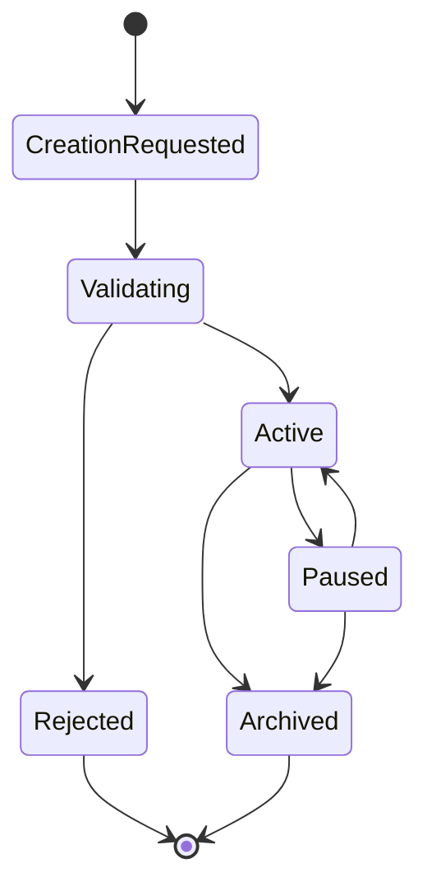
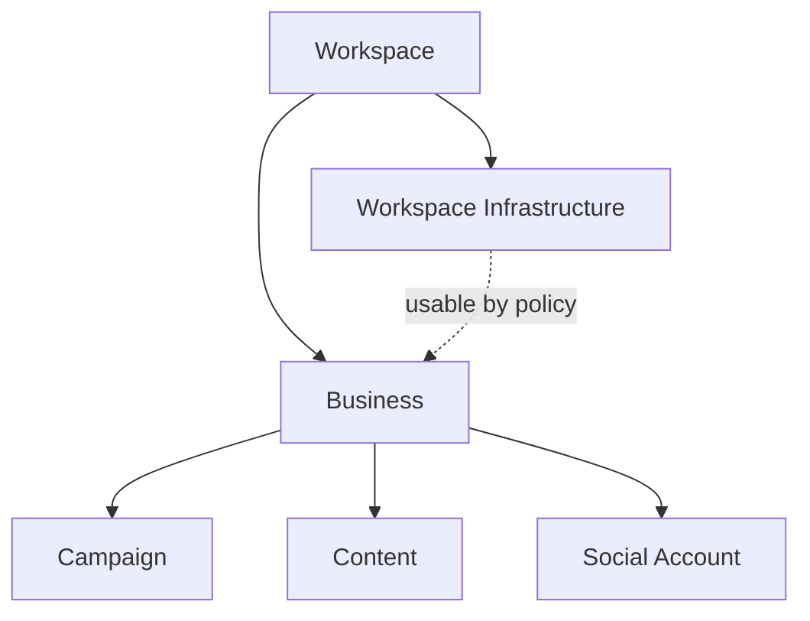
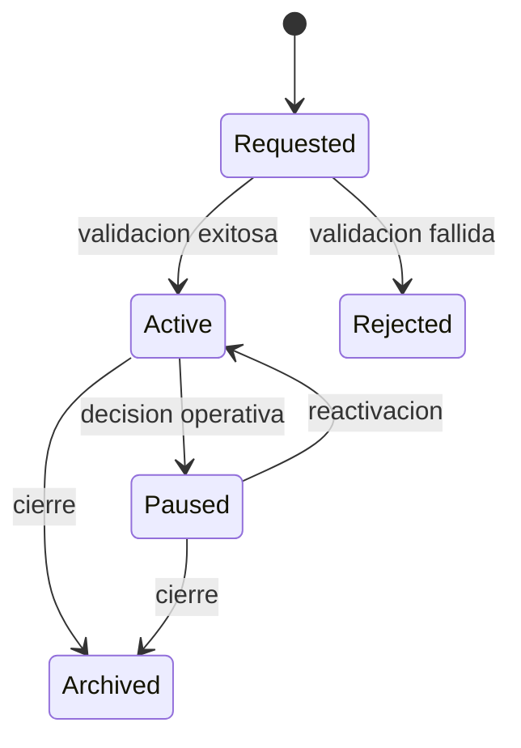
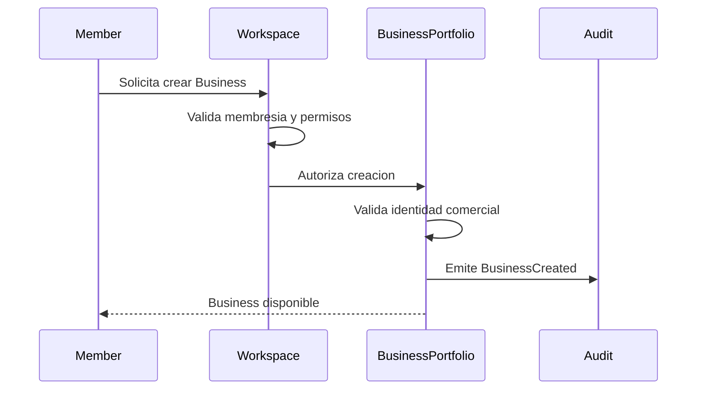
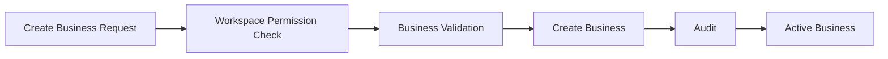

# Blueprint-0002: Create Business

## Purpose

Crear un Business dentro de un Workspace existente.

Un Business representa una marca, cliente o unidad comercial operada por el Workspace. No es tenant raiz y no posee infraestructura.

## Actors

- Workspace Member.
- Workspace Owner o rol autorizado.
- Business Portfolio.
- Audit & Observability.

## Business Rules

- Todo Business pertenece a un Workspace.
- Un Business no puede existir fuera de un Workspace.
- Un Business no posee VMs, proxies, agentes IA ni credenciales como infraestructura propia.
- Un Business puede tener contenido, campanas y cuentas sociales asociadas bajo gobierno del Workspace.
- Un Workspace puede tener multiples Businesses.
- Pausar un Business debe impedir nuevas operaciones asociadas a el, sin suspender el Workspace completo.

## Inputs

- WorkspaceId conceptual.
- Business name.
- Brand description.
- Locale.
- Timezone preferida, si difiere del Workspace.
- Member actor.
- Optional brand voice.

## Outputs

- BusinessId.
- Business status.
- Audit events.
- Relacion Workspace-Business.

## Lifecycle

## Relationships

Decision: la relacion punteada indica uso permitido por politica, no propiedad.

## Ownership

El Workspace posee el Business.

El Business posee identidad comercial y relaciones editoriales. No posee infraestructura operativa.

## Workspace Interaction

El Workspace:

- autoriza la creacion;
- aplica limites;
- define permisos;
- mantiene auditoria;
- gobierna recursos utilizables por el Business.

## Validation

- Workspace existe y esta operativo.
- Actor pertenece al Workspace.
- Actor tiene permiso para crear Business.
- Nombre no esta vacio.
- Nombre no genera conflicto comercial dentro del Workspace.
- Locale y timezone son coherentes.

## State Machine

## Sequence Diagram

## Mermaid Diagram

## Failure Scenarios

- Workspace suspendido.
- Actor sin permiso.
- Nombre invalido.
- Business duplicado segun criterio del Workspace.
- Politica del Workspace impide crear mas Businesses.

## Recovery Scenarios

- Corregir datos invalidos.
- Solicitar permiso a owner.
- Reactivar Workspace si estaba suspendido.
- Archivar o renombrar Business conflictivo.
- Revisar limite del Workspace.

## Security Notes

- No exponer informacion de otros Businesses.
- No permitir crear Business en Workspace ajeno.
- Registrar actor y razon comercial.

## Observability Notes

Eventos:

- BusinessCreationRequested.
- BusinessCreationRejected.
- BusinessCreated.
- BusinessPaused.
- BusinessArchived.

## Future Extensions

- Plantillas de marca.
- Reglas de aprobacion por industria.
- Segmentacion por equipos.
- Limites por Business sin cambiar propiedad de infraestructura.

## Open Questions

- Debe existir un owner especifico por Business?
- Habra categorias de riesgo por industria?
- Se permitiran Businesses compartidos entre Workspaces?

## Dependencies

- Workspace Management.
- Access & Membership.
- Business Portfolio.
- Audit & Observability.

## References

- `docs/domain/core-domain.md`
- `docs/domain/bounded-contexts.md`
- `docs/decisions/ADR-0005-workspace-as-first-class-domain.md`
