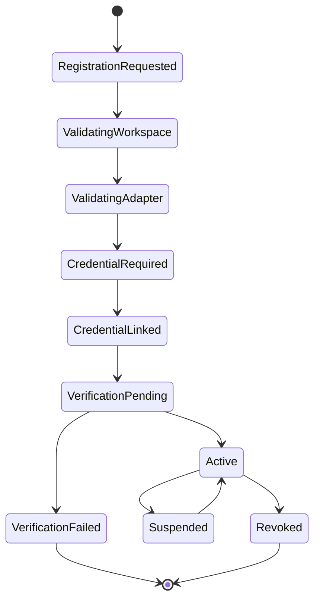
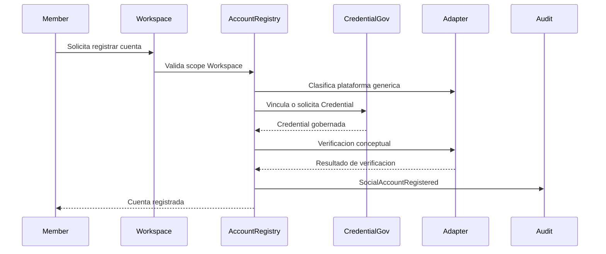
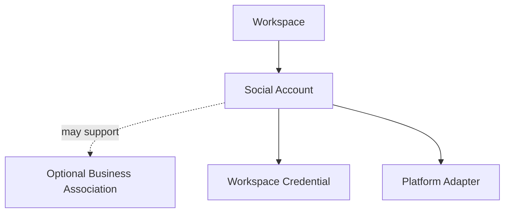

# Blueprint-0003: Register Social Account

## Purpose

Registrar una cuenta social o canal externo dentro de un Workspace mediante un modelo generico de adaptadores.

Este Blueprint debe servir para Instagram, Facebook, TikTok, WhatsApp, Google, LinkedIn y futuras plataformas sin convertir ninguna en modulo central.

## Actors

- Workspace Member.
- Credential Governance.
- Platform Connector Adapter.
- Business Portfolio.
- Audit & Observability.

## Business Rules

- Toda cuenta social pertenece al Workspace.
- Una cuenta social puede asociarse a un Business, pero no pertenece al Business como infraestructura.
- La plataforma externa es una capability adapter.
- Las credenciales asociadas se gobiernan como Credentials del Workspace.
- Registrar una cuenta no debe ejecutar automatizaciones.
- La validacion debe confirmar que la cuenta puede ser usada bajo politica del Workspace.

## Inputs

- Workspace reference.
- Optional Business reference.
- Platform family: Instagram, Facebook, TikTok, WhatsApp, Google, LinkedIn u otra futura.
- Account display name.
- Authorization evidence.
- Credential reference or credential onboarding intent.
- Actor.

## Outputs

- SocialAccountId conceptual.
- Credential relationship.
- Platform adapter classification.
- Account status.
- Audit events.

## State Machine

## Sequence Diagram

## Mermaid Diagram

## Validation

- Workspace activo.
- Actor autorizado.
- Plataforma soportada por adapter o marcada como pending support.
- Credential pertenece al mismo Workspace.
- Business asociado, si existe, pertenece al mismo Workspace.
- No registrar duplicado peligroso de la misma cuenta externa.
- No almacenar secretos dentro del registro de cuenta.

## Failure Scenarios

- Workspace suspendido.
- Adapter no disponible.
- Credential invalida o revocada.
- Cuenta externa ya registrada.
- Business asociado no pertenece al Workspace.
- Verificacion externa fallida.
- Permisos insuficientes para operar la cuenta.

## Recovery Scenarios

- Reintentar verificacion con la misma Credential si el fallo es temporal.
- Reemplazar Credential si fue revocada.
- Marcar cuenta como `VerificationFailed` sin eliminar auditoria.
- Suspender cuenta si se detecta riesgo.
- Reasociar Business si la relacion inicial fue incorrecta.

## Security Notes

- Secretos nunca se guardan en el registro de cuenta.
- No revelar tokens en eventos.
- Validar pertenencia al Workspace en cada relacion.
- Registrar actor y razon.
- No permitir que un adapter otorgue permisos fuera del Workspace.

## Observability Notes

Eventos:

- SocialAccountRegistrationRequested.
- SocialAccountCredentialLinked.
- SocialAccountVerificationFailed.
- SocialAccountRegistered.
- SocialAccountSuspended.
- SocialAccountRevoked.

## Future Extensions

- Multiples cuentas por plataforma.
- Scopes de permisos por capability.
- Revalidacion programada.
- Health score de cuenta.
- Asociacion con campanas.

## Open Questions

- Como se representaran cuentas con multiples paginas o propiedades externas?
- Se permitira una misma cuenta externa en dos Workspaces?
- Que nivel de verificacion manual sera obligatorio para cuentas sensibles?

## Dependencies

- Workspace Management.
- Credential Governance.
- Business Portfolio.
- Platform Connectors como adapters.
- Audit & Observability.

## References

- `docs/domain/ubiquitous-language.md`
- `docs/domain/bounded-contexts.md`
- `docs/decisions/ADR-0003-clean-architecture.md`
- `docs/decisions/ADR-0005-workspace-as-first-class-domain.md`
