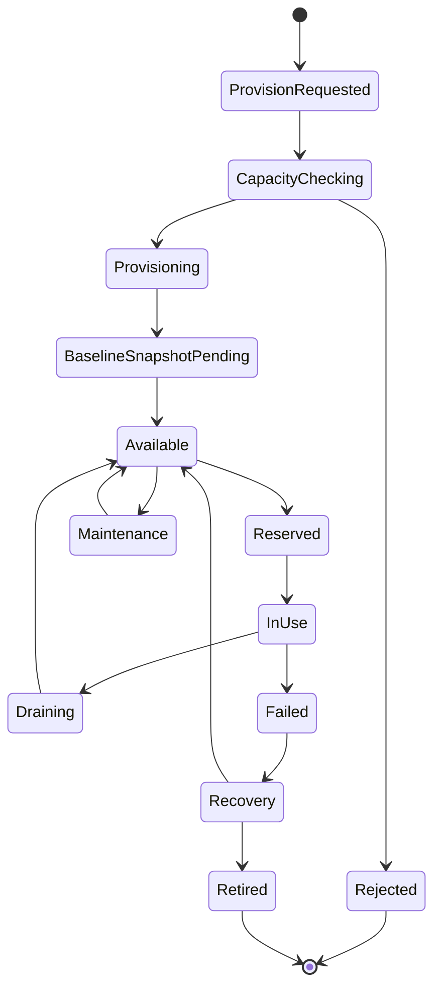
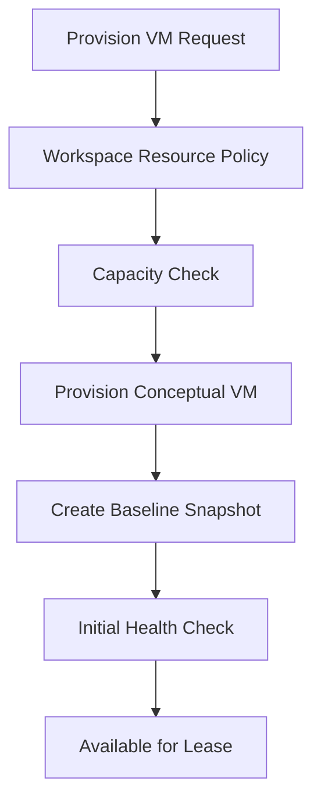
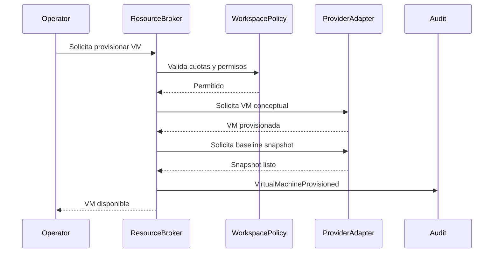
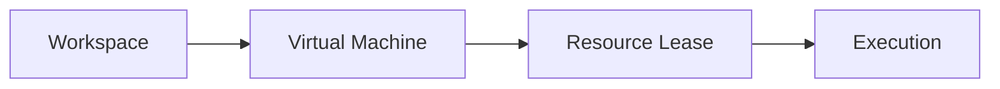

# Blueprint-0004: Provision Virtual Machine

## Purpose

Provisionar una Virtual Machine como recurso propiedad del Workspace.

La VM es infraestructura operativa del Workspace y puede ser usada por Executions mediante leases. No pertenece a un Business.

## Actors

- Workspace Operator.
- Execution Resources.
- Resource Broker.
- Audit & Observability.
- Infrastructure Provider Adapter.

## Business Rules

- Toda VM pertenece a un Workspace o a un pool asignable bajo politica de Workspace.
- Un Business no posee VMs.
- Una VM no debe usarse sin health valido.
- Una VM no debe ser asignada directamente por un Worker.
- El uso operacional ocurre mediante Resource Lease.
- Snapshot strategy debe definirse antes de uso productivo.

## Inputs

- Workspace reference.
- VM purpose.
- Capacity class conceptual.
- Isolation requirement.
- Snapshot policy.
- Actor.

## Outputs

- VirtualMachineId conceptual.
- VM status.
- Health state.
- Snapshot baseline status.
- Audit events.

## Lifecycle

## VM Allocation

## Resource Validation

- Workspace activo.
- Actor autorizado.
- Capacidad disponible.
- Politica permite VM.
- Proposito compatible.
- Snapshot policy definida.
- No excede cuotas del Workspace.

## Capacity Checks

La capacidad se evalua antes de provisionar.

Criterios:

- cuota del Workspace;
- pool disponible;
- clase de aislamiento;
- costo operacional;
- capacidad futura de concurrencia;
- mantenimiento programado.

## Snapshot Strategy

Cada VM productiva debe tener estrategia conceptual de snapshot:

- baseline snapshot antes de uso;
- recovery snapshot bajo politica;
- snapshot before risky operation, si aplica;
- snapshot retention definida;
- snapshot auditado.

Decision: snapshot no es detalle tecnico menor; es parte de recuperacion operacional.

## Sequence Diagram

## Mermaid Diagram

## Failure Scenarios

- Workspace no permite nuevas VMs.
- Capacidad insuficiente.
- Provision incompleta.
- Baseline snapshot falla.
- Health inicial falla.
- VM queda degradada.
- Provider externo no responde.

## Recovery Scenarios

- Reintentar provision si fallo temporal.
- Marcar VM como `Failed` si existe pero no es segura.
- Retirar VM si no puede recuperarse.
- Reintentar snapshot antes de habilitarla.
- Escalar a revision manual si hay inconsistencia de estado.

## Security Notes

- VM no debe compartir secretos entre Workspaces.
- VM no debe pasar a `Available` sin baseline seguro.
- Acceso directo debe estar gobernado.
- Uso de VM debe quedar asociado a Resource Lease y Execution.

## Observability Notes

Eventos:

- VirtualMachineProvisionRequested.
- VirtualMachineCapacityChecked.
- VirtualMachineProvisioned.
- VirtualMachineSnapshotCreated.
- VirtualMachineHealthChanged.
- VirtualMachineFailed.
- VirtualMachineRecovered.
- VirtualMachineRetired.

## Future Extensions

- Pools dedicados por Workspace.
- Pools compartidos con aislamiento fuerte.
- Snapshots por tipo de ejecucion.
- Scoring de salud.
- Cost tracking por Workspace.

## Open Questions

- Que VMs seran dedicadas vs compartidas?
- Cuales son clases de capacidad iniciales?
- Que politica de retencion de snapshots aplica?

## Dependencies

- Workspace Management.
- Execution Resources.
- Resource Broker definido por RFC-0001.
- Audit & Observability.
- Infrastructure Provider Adapter.

## References

- `docs/rfc/RFC-0001-execution-engine.md`
- `docs/decisions/ADR-0005-workspace-as-first-class-domain.md`
- `docs/decisions/ADR-0006-execution-engine-as-platform-core.md`
