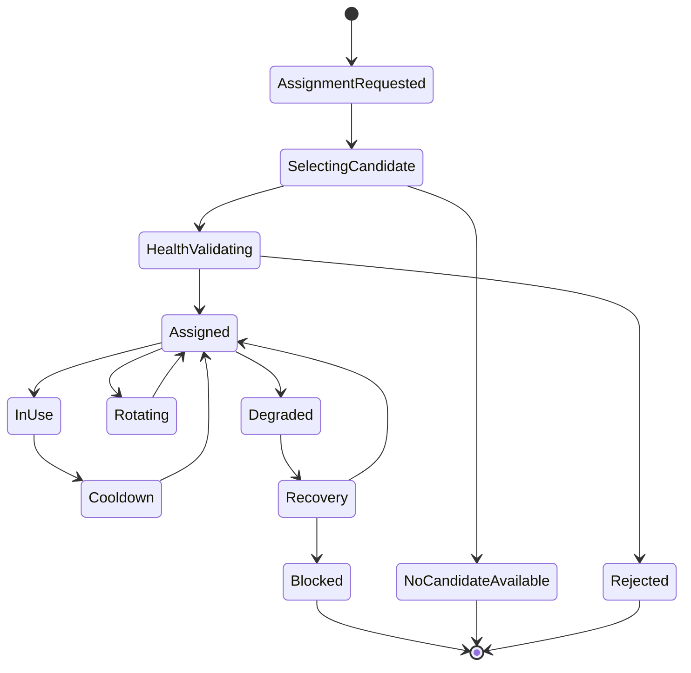
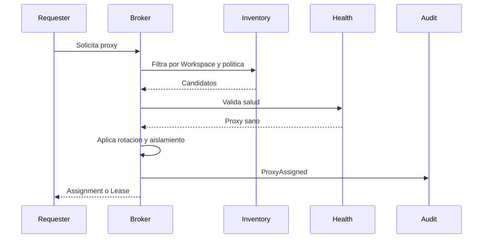
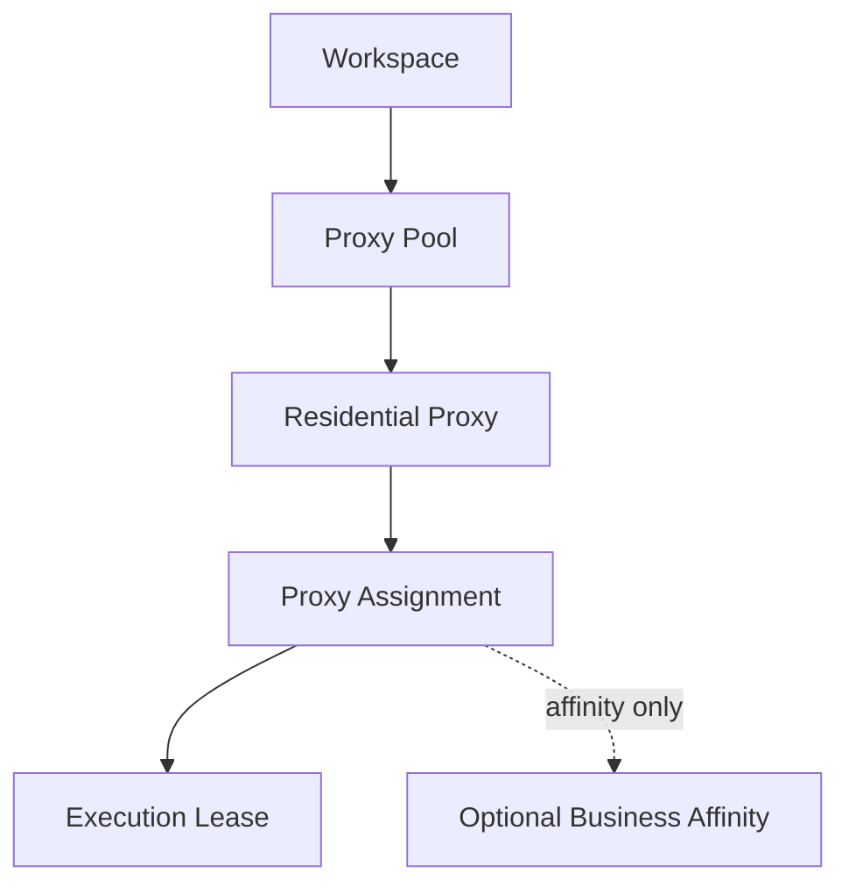

# Blueprint-0005: Assign Residential Proxy

## Purpose

Asignar un proxy residencial como recurso gobernado del Workspace.

El proxy protege aislamiento, reputacion, ubicacion operacional y control de trafico. No pertenece a un Business, aunque puede reservarse para usos relacionados a un Business bajo politica del Workspace.

## Actors

- Workspace Operator.
- Resource Broker.
- Proxy Inventory.
- Audit & Observability.
- Execution Engine.

## Business Rules

- Todo proxy asignado pertenece al Workspace o a un pool gobernado por Workspace.
- Un Business no posee proxies.
- El proxy debe estar sano antes de asignarse.
- El proxy debe respetar reglas de aislamiento.
- Un proxy puede tener cooldown.
- Un proxy bloqueado no puede asignarse.
- Las Executions usan proxies mediante lease, no por acceso directo.

## Inputs

- Workspace reference.
- Optional Business affinity.
- Region preference.
- Risk level.
- Isolation requirement.
- Rotation policy.
- Actor or Execution request.

## Outputs

- ProxyAssignmentId conceptual.
- Proxy resource reference.
- Assignment status.
- Rotation policy.
- Audit events.

## Selection Algorithm

Modelo conceptual, no implementacion:

1. Filtrar proxies pertenecientes o permitidos para el Workspace.
2. Excluir proxies bloqueados, degradados o en cooldown.
3. Aplicar requerimientos de region.
4. Aplicar aislamiento requerido.
5. Evaluar historial de salud.
6. Evaluar afinidad previa con Business o cuenta, si la politica lo permite.
7. Evaluar carga actual.
8. Seleccionar candidato con menor riesgo operacional.
9. Crear assignment o lease.
10. Emitir evento auditable.

Decision: la afinidad reduce cambios riesgosos; la rotacion evita sobreuso. La politica decide el equilibrio.

## State Machine

## Sequence Diagram

## Mermaid Diagram

## Health Validation

- conectividad conceptual;
- reputacion operacional;
- region esperada;
- cooldown vencido;
- no bloqueado;
- no degradado;
- carga aceptable;
- compatibilidad con Workspace.

## Rotation

La rotacion puede ser:

- manual;
- por degradacion;
- por cooldown;
- por politica temporal;
- por cambio de riesgo;
- por fallo de Execution.

Rotar no debe romper idempotencia de Execution. Si el cambio puede duplicar efectos externos, debe pasar por recuperacion controlada.

## Isolation

Niveles conceptuales:

- Dedicated to Workspace;
- Dedicated to Business affinity;
- Shared within Workspace;
- Shared pool with strict policy.

Decision: el aislamiento es una regla de negocio operacional, no un detalle de red.

## Failure Scenarios

- No hay proxy candidato.
- Proxy falla health check.
- Proxy entra en cooldown.
- Proxy queda bloqueado.
- Conflicto de aislamiento.
- Rotacion durante Execution sensible.
- Provider externo degrada pool.

## Recovery Scenarios

- Esperar en `WaitingForResources`.
- Reintentar seleccion con backoff.
- Usar proxy alternativo compatible.
- Marcar proxy degradado.
- Bloquear proxy si existe riesgo.
- Requerir revision manual si hubo accion externa parcial.

## Security Notes

- No exponer credenciales del proxy.
- No compartir proxy entre Workspaces sin politica explicita.
- Registrar asignacion, actor y razon.
- Evitar rotaciones invisibles durante operaciones sensibles.

## Observability Notes

Eventos:

- ProxyAssignmentRequested.
- ProxyCandidateSelected.
- ProxyHealthValidationFailed.
- ProxyAssigned.
- ProxyRotationRequested.
- ProxyRotated.
- ProxyCooldownStarted.
- ProxyDegraded.
- ProxyBlocked.

## Future Extensions

- Health scoring historico.
- Cost tracking.
- Reputacion por plataforma adapter.
- Afinidad por cuenta social.
- Reglas por geografia.

## Open Questions

- Que criterios exactos definen "degradado"?
- Habra proxies dedicados por Workspace desde el inicio?
- Se permitira afinidad permanente por Business?

## Dependencies

- Workspace Management.
- Execution Resources.
- Resource Broker.
- Audit & Observability.
- RFC-0001 Execution Engine.

## References

- `docs/rfc/RFC-0001-execution-engine.md`
- `docs/domain/ubiquitous-language.md`
- `docs/decisions/ADR-0005-workspace-as-first-class-domain.md`
- `docs/decisions/ADR-0006-execution-engine-as-platform-core.md`
