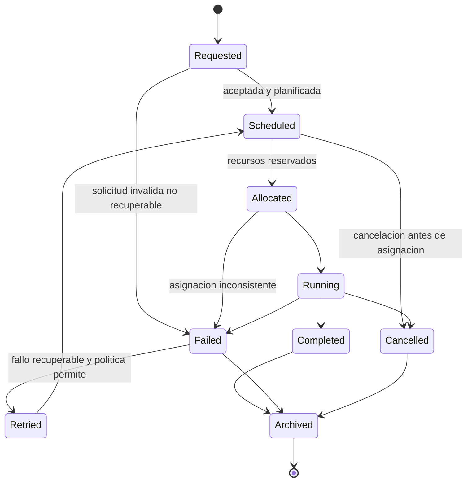
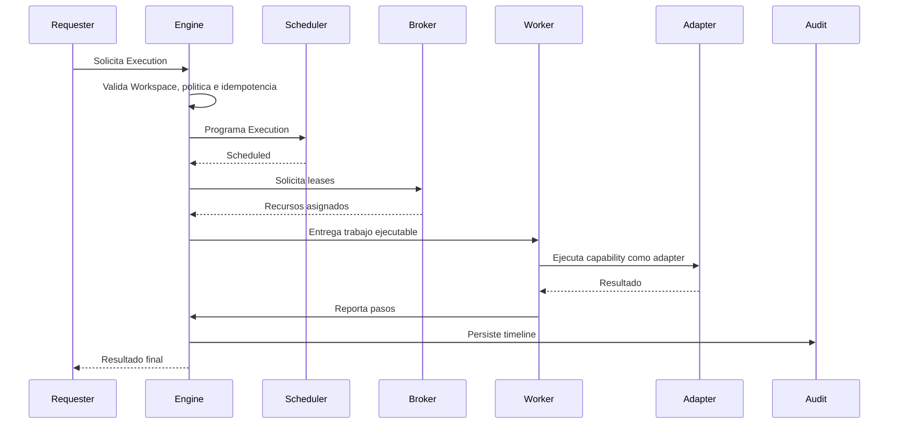
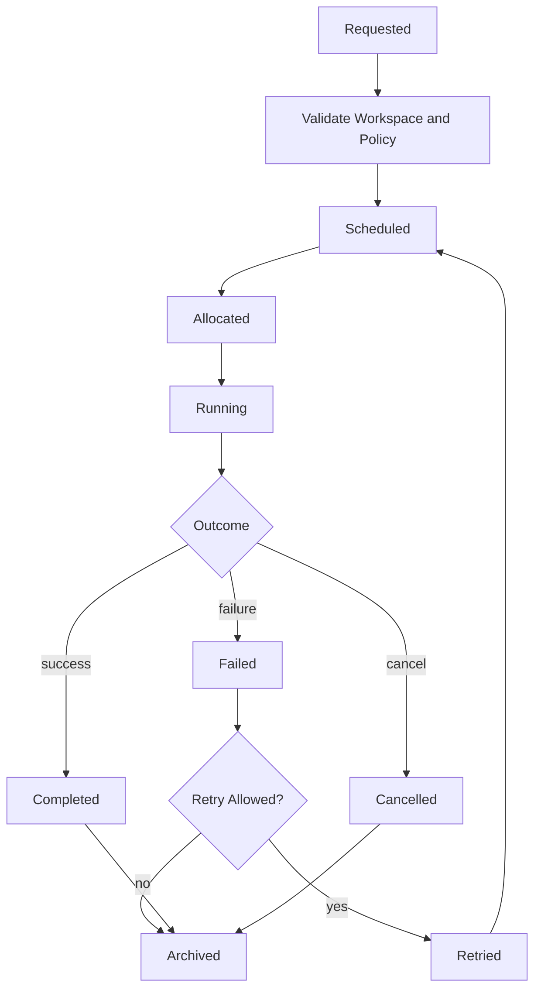

# Blueprint-0006: Execution Lifecycle

## Purpose

Definir el ciclo funcional de toda Execution en RRSS AUTO.

Toda automatizacion futura debe entrar por este ciclo. Ninguna capability puede crear su propio modelo de ejecucion.

## Actors

- Execution Requester.
- Execution Engine.
- Scheduler.
- Resource Broker.
- Worker.
- Capability Adapter.
- Audit & Observability.

## Business Rules

- Toda Execution pertenece a un Workspace.
- Toda Execution nace desde una intencion valida.
- Toda Execution debe tener estado.
- Todo cambio de estado debe ser auditable.
- Toda asignacion de recurso ocurre mediante lease.
- Todo fallo debe clasificarse.
- Todo retry debe obedecer politica.
- Todo estado terminal debe poder archivarse.
- Ninguna capability ejecuta fuera del Engine.

## Inputs

- Workspace reference.
- Execution intent.
- Actor or system initiator.
- Policy context.
- Required capabilities.
- Idempotency reference.
- Optional schedule.

## Outputs

- ExecutionId conceptual.
- Execution status.
- Timeline.
- Resource leases.
- Step results.
- Audit events.
- Final outcome.

## Canonical State Machine

## State Definitions

### Requested

La Execution fue solicitada y aun no tiene compromiso operacional completo.

Decision: permite validar Workspace, permisos, politicas e idempotencia antes de consumir recursos.

### Scheduled

La Execution fue aceptada y tiene una ventana, prioridad o posicion operacional.

Decision: scheduled no significa running. Significa que el Engine decidio cuando puede competir por recursos.

### Allocated

Los recursos requeridos fueron reservados mediante leases.

Decision: esta etapa separa asignacion de ejecucion real para poder fallar limpiamente antes de efectos externos.

### Running

La Execution esta ejecutando Steps.

Decision: solo en este estado puede invocar capabilities mediante adapters.

### Completed

Todos los Steps requeridos terminaron exitosamente.

### Failed

La Execution no pudo completar su objetivo.

El fallo puede ser recuperable o terminal, pero debe clasificarse.

### Cancelled

La Execution fue detenida por actor, politica o sistema antes de completarse.

### Retried

La Execution fallida fue aceptada para otro intento bajo politica.

Decision: Retry es estado explicito para auditar que no se trata de una ejecucion nueva sin relacion.

### Archived

La Execution queda cerrada para operacion activa y retenida para auditoria.

Decision: archivar separa fin operacional de retencion historica.

## Sequence Diagram

## Execution Flow Diagram

## Failure Scenarios

- Workspace suspendido.
- Idempotency conflict.
- Scheduler rechaza por politica.
- Recursos no disponibles.
- Lease vencido.
- Worker pierde heartbeat.
- Capability adapter falla.
- Step produce resultado ambiguo.
- Actor cancela.
- Politica cambia durante ejecucion.

## Recovery Scenarios

- Reprogramar si no hay recursos.
- Reintentar con backoff y jitter.
- Reasignar recursos si el fallo fue de VM, proxy o IA.
- Marcar para revision manual si hay efecto externo ambiguo.
- Cancelar limpiamente y liberar leases.
- Archivar con failure report si es terminal.

## Security Notes

- Toda Execution debe validar Workspace.
- Los Workers no acceden a recursos sin lease.
- Capabilities no reciben mas permisos que los necesarios.
- Los eventos no deben contener secretos.
- La timeline debe registrar actor, politica y recursos.

## Observability Notes

Eventos minimos:

- ExecutionRequested.
- ExecutionScheduled.
- ExecutionAllocated.
- ExecutionStarted.
- ExecutionStepCompleted.
- ExecutionFailed.
- ExecutionCancelled.
- ExecutionRetried.
- ExecutionCompleted.
- ExecutionArchived.

## Future Extensions

- Approval gates.
- Human-in-the-loop.
- Execution templates.
- Priority lanes.
- Cost accounting.
- SLA per Workspace.
- Replay controlado.

## Open Questions

- Que estados requeriran aprobacion humana?
- Cuando se archiva automaticamente?
- Que retencion aplica por tipo de Execution?
- Como se representara un resultado parcialmente exitoso?

## Dependencies

- RFC-0001 Execution Engine.
- Workspace Management.
- Resource Broker.
- Audit & Observability.
- Capability Adapters.

## References

- `docs/rfc/RFC-0001-execution-engine.md`
- `docs/decisions/ADR-0006-execution-engine-as-platform-core.md`
- `docs/domain/domain-events.md`
