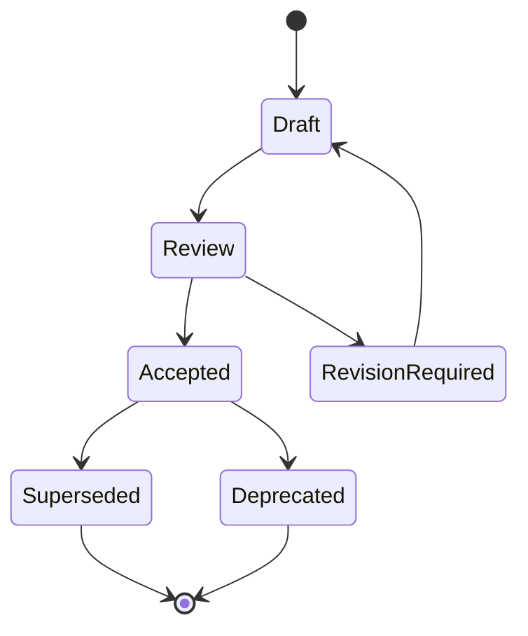

# Blueprints

Los Blueprints describen como debe funcionar el negocio dentro de RRSS AUTO.

No son especificaciones de codigo, APIs, SQL, infraestructura ni UI. Son documentos funcionales y arquitectonicos que explican flujos, reglas, estados, eventos, recuperacion y decisiones que toda implementacion futura debe respetar.

## Proposito

Los Blueprints convierten la arquitectura en comportamientos de negocio implementables.

Responden:

- que quiere lograr el usuario;
- que reglas protegen al Workspace;
- que estados puede atravesar el flujo;
- que eventos deben quedar auditados;
- que errores son recuperables;
- que relaciones existen con RFCs y ADRs.

## Filosofia

RRSS AUTO es una plataforma multi-tenant de ejecucion gobernada.

Por eso los Blueprints obedecen estas reglas:

- `Workspace` es el concepto superior.
- Nada existe fuera de un Workspace.
- Businesses no poseen infraestructura.
- La infraestructura pertenece al Workspace.
- Toda automatizacion se expresa como Execution.
- Las capacidades externas son adaptadores.
- La documentacion precede a la implementacion.

## Ciclo de vida de un Blueprint

## Convenciones de nombres

Formato:

`Blueprint-000N-short-name.md`

Reglas:

- numeracion incremental;
- nombre en ingles tecnico simple;
- contenido en espanol;
- un Blueprint por flujo de negocio;
- no mezclar varios procesos independientes en un solo documento.

## Relacion con RFCs

Los RFCs definen arquitectura amplia o subsistemas fundacionales.

Los Blueprints aplican esos RFCs a flujos de negocio concretos.

Ejemplo: `RFC-0001` define el Execution Engine. `Blueprint-0006` define como una Execution atraviesa estados desde el punto de vista funcional.

## Relacion con ADRs

Las ADRs registran decisiones aceptadas.

Los Blueprints no deben contradecir ADRs. Cuando un Blueprint depende de una decision, debe referenciarla.

ADRs obligatorias para estos documentos:

- ADR-0001: monorepo modular;
- ADR-0002: documentacion primero;
- ADR-0003: arquitectura limpia;
- ADR-0004: multi-tenant inicial, reinterpretado por ADR-0005 como Workspace-first;
- ADR-0005: Workspace como concepto principal;
- ADR-0006: Execution Engine como nucleo operativo.

## Blueprints actuales

- `Blueprint-0001-create-workspace.md`
- `Blueprint-0002-create-business.md`
- `Blueprint-0003-register-social-account.md`
- `Blueprint-0004-provision-virtual-machine.md`
- `Blueprint-0005-assign-residential-proxy.md`
- `Blueprint-0006-execution-lifecycle.md`
