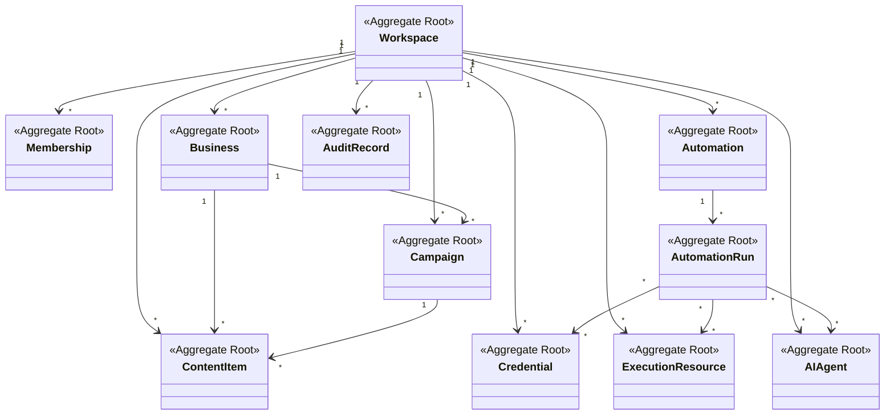

# Agregados, Entidades y Value Objects

## Criterio de diseno

Un agregado protege invariantes. No es simplemente un grupo de tablas futuras.

RRSS AUTO debe mantener agregados suficientemente pequenos para evitar bloqueos conceptuales, pero suficientemente fuertes para proteger reglas importantes.

## Aggregate: Workspace

Raiz: `Workspace`.

Entidades internas posibles:

- Workspace Settings;
- Workspace Limits;
- Workspace Status.

Value Objects:

- WorkspaceId;
- WorkspaceName;
- WorkspaceStatus;
- WorkspacePlan;
- Timezone;

Invariantes:

- un Workspace debe tener identidad unica;
- un Workspace activo puede contener negocios y recursos;
- limites globales del Workspace deben aplicarse a automatizaciones y recursos;
- todo recurso operativo debe poder asociarse al Workspace.

Decision: Workspace es agregado raiz porque define el limite multi-tenant principal.

## Aggregate: Membership

Raiz: `Membership`.

Entidades:

- Member;
- Role Assignment;
- Invitation.

Value Objects:

- MemberId;
- Role;
- Permission;
- EmailAddress;
- InvitationStatus.

Invariantes:

- un Member no puede operar fuera de los permisos asignados;
- una invitacion pertenece a un Workspace;
- los roles deben resolverse dentro del Workspace.

Decision: Membership se separa de Workspace para evitar que permisos conviertan al agregado Workspace en un objeto gigante.

## Aggregate: Business

Raiz: `Business`.

Entidades:

- Business Profile;
- Brand Settings;
- Platform Presence.

Value Objects:

- BusinessId;
- BusinessName;
- BrandVoice;
- Locale;
- BusinessStatus.

Invariantes:

- un Business pertenece a un Workspace;
- su identidad de marca no debe mezclarse con otra;
- puede estar activo, pausado o archivado.

Decision: Business representa marcas o clientes operados dentro de un Workspace.

## Aggregate: Credential

Raiz: `Credential`.

Entidades:

- Credential Assignment;
- Credential Rotation Record;
- Credential Validation Record.

Value Objects:

- CredentialId;
- CredentialType;
- SecretReference;
- CredentialStatus;
- ExpirationDate;
- PlatformName.

Invariantes:

- una Credential pertenece a un Workspace;
- el secreto real no forma parte del modelo de dominio visible;
- una Credential revocada no puede usarse en nuevas ejecuciones;
- una Credential debe declarar su tipo y proposito.

Decision: se modela como agregado propio porque seguridad y rotacion no deben depender de campanas o conectores.

## Aggregate: Campaign

Raiz: `Campaign`.

Entidades:

- Campaign Goal;
- Campaign Target;
- Campaign Content Link.

Value Objects:

- CampaignId;
- CampaignName;
- CampaignStatus;
- DateRange;
- CampaignGoalType.

Invariantes:

- una Campaign pertenece a un Workspace;
- puede asociarse a uno o varios Business segun politica;
- no debe ejecutar acciones directamente.

Decision: Campaign agrupa intencion comercial, no ejecucion tecnica.

## Aggregate: Content

Raiz: `ContentItem`.

Entidades:

- Media Asset;
- Content Variant;
- Approval Record.

Value Objects:

- ContentId;
- Caption;
- HashtagSet;
- ApprovalStatus;
- PlatformTarget;
- ScheduledWindow.

Invariantes:

- un ContentItem pertenece a un Workspace;
- puede asociarse a Business y Campaign;
- contenido no aprobado no debe ser ejecutado por automatizaciones productivas;
- variantes por plataforma no deben sobrescribir el contenido base sin decision explicita.

Decision: Content es agregado independiente porque su ciclo editorial no es igual al ciclo de automatizacion.

## Aggregate: Automation

Raiz: `Automation`.

Entidades:

- Automation Policy;
- Automation Schedule;
- Automation Trigger.

Value Objects:

- AutomationId;
- AutomationType;
- AutomationStatus;
- RetryPolicy;
- RateLimit;
- ExecutionWindow.

Invariantes:

- una Automation pertenece a un Workspace;
- debe declarar que recursos puede usar;
- debe respetar politicas del Workspace;
- no debe ejecutarse sin estar habilitada.

Decision: Automation representa configuracion e intencion, no una ejecucion concreta.

## Aggregate: Automation Run

Raiz: `AutomationRun`.

Entidades:

- Automation Step;
- Automation Artifact Reference;
- Failure Detail.

Value Objects:

- RunId;
- RunStatus;
- StepStatus;
- StartedAt;
- FinishedAt;
- FailureReason.

Invariantes:

- un Run pertenece a una Automation y a un Workspace;
- un Run debe tener estado final;
- los pasos deben conservar orden;
- los artefactos deben ser asociables al Run.

Decision: separar Run de Automation permite auditoria historica y reintentos sin alterar la definicion original.

## Aggregate: Execution Resource

Raices posibles:

- `VirtualMachine`;
- `Proxy`;
- `BrowserProfile`;
- `AndroidDevice`.

Entidades:

- Resource Assignment;
- Health Check;
- Reservation.

Value Objects:

- ResourceId;
- ResourceStatus;
- ReservationWindow;
- HealthStatus;
- NetworkRegion.

Invariantes:

- un recurso pertenece o esta asignado a un Workspace;
- un recurso no puede estar reservado de forma incompatible;
- recursos en mal estado no deben usarse para nuevas ejecuciones.

Decision: recursos de ejecucion son agregados separados porque tienen ciclos de vida distintos.

## Aggregate: AI Agent

Raiz: `AIAgent`.

Entidades:

- Agent Policy;
- Tool Permission;
- Prompt Version;
- Agent Run.

Value Objects:

- AgentId;
- AgentPurpose;
- ModelProvider;
- PromptTemplateId;
- SafetyLevel;

Invariantes:

- un Agent pertenece a un Workspace;
- no puede usar herramientas fuera de su politica;
- prompts relevantes deben ser versionados;
- acciones sensibles requieren politica explicita.

Decision: Agent es una capacidad gobernada, no un simple helper tecnico.

## Aggregate: Audit Record

Raiz: `AuditRecord`.

Entidades:

- Audit Actor;
- Audit Target;
- Audit Metadata.

Value Objects:

- AuditId;
- EventType;
- ActorId;
- OccurredAt;
- TraceId.

Invariantes:

- un registro de auditoria no debe modificarse semanticamente;
- debe poder asociarse a Workspace;
- debe preservar suficiente contexto para investigacion.

Decision: auditoria es transversal, pero necesita modelo propio para no depender de logs tecnicos.

## Relacion entre agregados

## Nota importante

Las flechas representan relaciones de dominio, no claves foraneas ni esquema de base de datos.
