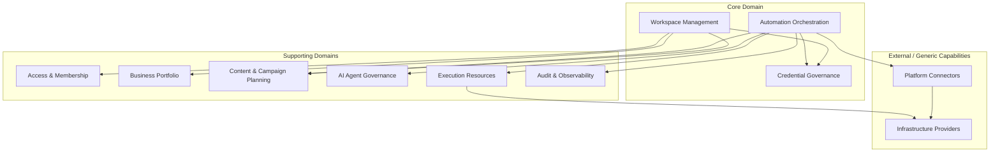

# Bounded Contexts

## Resumen

## Workspace Management

Responsabilidad: definir el espacio operativo principal.

Incluye:

- Workspace;
- configuracion del Workspace;
- estado del Workspace;
- limites globales.

No incluye:

- reglas internas de cada plataforma;
- ejecucion tecnica de automatizaciones;
- almacenamiento concreto de secretos.

Decision: es Core Domain porque todo lo demas se organiza alrededor de Workspace.

## Access & Membership

Responsabilidad: controlar quien puede actuar dentro de un Workspace.

Incluye:

- Members;
- roles;
- permisos;
- invitaciones;
- pertenencia al Workspace.

Relacion: depende conceptualmente de Workspace, pero no debe gobernar campanas, contenido ni automatizaciones.

Decision: se separa para que seguridad y permisos evolucionen sin contaminar el dominio operativo.

## Business Portfolio

Responsabilidad: representar los negocios administrados dentro del Workspace.

Incluye:

- Businesses;
- identidad de marca;
- configuracion por negocio;
- relacion con plataformas y contenido.

Relacion: Campaigns y Content pueden asociarse a Business.

Decision: un Workspace puede operar muchos negocios; esto evita duplicar infraestructura y miembros por cada marca.

## Credential Governance

Responsabilidad: gobernar credenciales y accesos sensibles.

Incluye:

- Credential;
- Credential Assignment;
- Credential Policy;
- rotacion;
- vencimiento;
- estado de validez.

Relacion: Automation solicita uso de credenciales; Credential Governance decide si estan disponibles y permitidas.

Decision: se separa porque seguridad, auditoria y rotacion tienen reglas propias.

## Content & Campaign Planning

Responsabilidad: planificar contenido y campanas.

Incluye:

- Campaign;
- Content Item;
- Media Asset;
- calendario;
- aprobaciones;
- variantes por plataforma.

Relacion: Automation puede ejecutar acciones sobre contenido aprobado.

Decision: planificar no es ejecutar. Esta separacion evita que el calendario editorial dependa de fallos tecnicos externos.

## Automation Orchestration

Responsabilidad: convertir intenciones operativas en ejecuciones auditables.

Incluye:

- Automation;
- Automation Policy;
- Automation Run;
- Automation Step;
- scheduling;
- reintentos;
- cancelacion;
- estado.

Relacion: coordina Credential Governance, Content & Campaign Planning, AI Agent Governance, Execution Resources y Platform Connectors.

Decision: es Core Domain porque RRSS AUTO es una plataforma de automatizacion multi-tenant.

## Execution Resources

Responsabilidad: gobernar recursos necesarios para ejecutar acciones.

Incluye:

- Virtual Machine;
- Proxy;
- Browser Profile;
- Android Device;
- Resource Reservation.

Relacion: Automation Orchestration reserva recursos; Execution Resources informa disponibilidad y restricciones.

Decision: recursos como proxies y VMs afectan directamente seguridad, reputacion y aislamiento.

## AI Agent Governance

Responsabilidad: controlar agentes de IA y sus politicas.

Incluye:

- AI Agent;
- Prompt Template;
- Model Provider;
- Agent Policy;
- Agent Run.

Relacion: Automation puede solicitar asistencia de un Agent, pero el Agent debe respetar politicas.

Decision: se evita que la IA sea una dependencia informal repartida por el sistema.

## Platform Connectors

Responsabilidad: traducir acciones internas a plataformas externas.

Incluye conectores futuros para:

- Facebook;
- Instagram;
- Meta Ads;
- WhatsApp Business;
- TikTok;
- Gmail.

Relacion: Automation Orchestration solicita acciones; Connector ejecuta contra una plataforma externa.

Decision: los conectores protegen el dominio de cambios de APIs externas.

## Audit & Observability

Responsabilidad: preservar evidencia y trazabilidad.

Incluye:

- Audit Log;
- Domain Event Log;
- Artifact;
- Failure Report;
- Run Timeline.

Relacion: escucha eventos de todos los contextos.

Decision: la plataforma debe poder explicar que ocurrio, cuando, por que y con que recursos.
