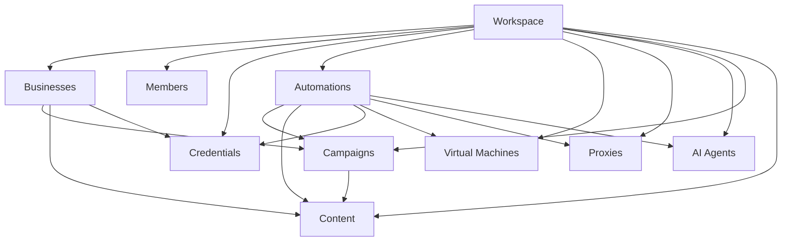
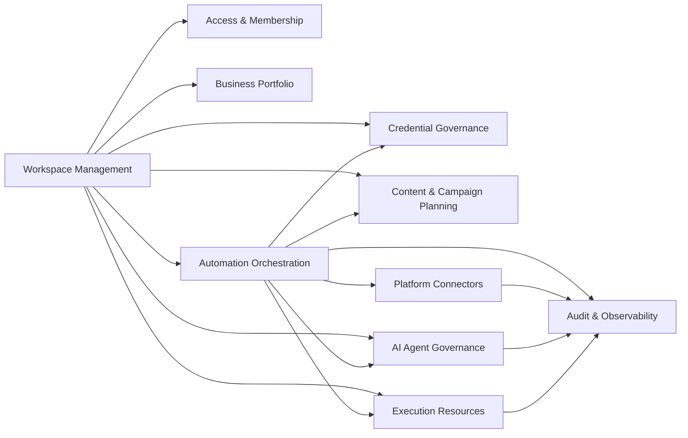
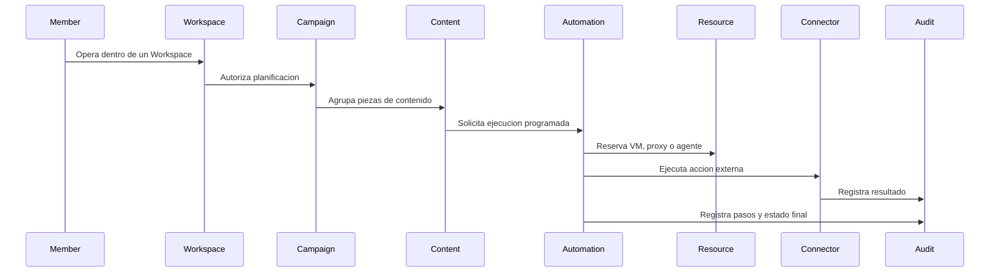

# RRSS AUTO Sprint 1.0: Core Domain Design

## Por que este diseno existe

RRSS AUTO no es un bot de redes sociales. Es una plataforma multi-tenant de automatizacion donde varios negocios, cuentas, credenciales, agentes, maquinas virtuales, proxies, campanas y contenidos deben convivir sin mezclarse.

Por eso el dominio no debe girar alrededor de "publicar en redes". Debe girar alrededor de `Workspace`, porque el problema principal es gobernar recursos, permisos, automatizaciones y ejecuciones dentro de un espacio aislado.

## Decision central

`Workspace` es el agregado y concepto raiz de la plataforma a nivel de tenant.

Un Workspace posee:

- Businesses;
- Members;
- Credentials;
- Automations;
- Virtual Machines;
- Proxies;
- AI Agents;
- Campaigns;
- Content.

Esto permite que RRSS AUTO crezca desde un uso pequeno hasta una operacion multi-negocio sin redisenar la identidad del sistema.

## Mapa conceptual

## Interpretacion del mapa

El Workspace no ejecuta trabajo por si mismo. Su responsabilidad es poseer y limitar el universo operativo.

Los negocios representan unidades comerciales dentro del Workspace. Las campanas y contenidos pueden asociarse a negocios, pero siguen gobernados por el Workspace.

Las automatizaciones coordinan recursos. No son simplemente tareas tecnicas: son intenciones operativas auditables que pueden usar credenciales, proxies, maquinas virtuales, agentes de IA y contenido.

## Contextos delimitados

## Por que estos contextos

Cada contexto tiene una razon de cambio distinta.

`Workspace Management` cambia cuando cambia el modelo multi-tenant.

`Access & Membership` cambia cuando cambian permisos, roles o usuarios.

`Business Portfolio` cambia cuando cambia la forma de representar negocios internos de un Workspace.

`Credential Governance` cambia por seguridad, rotacion, vencimiento o proveedores.

`Content & Campaign Planning` cambia por necesidades editoriales y comerciales.

`Automation Orchestration` cambia por reglas de ejecucion, scheduling, reintentos y politicas.

`Execution Resources` cambia por infraestructura: VMs, proxies, navegadores y Android.

`AI Agent Governance` cambia por modelos, prompts, herramientas y politicas de IA.

`Platform Connectors` cambia por APIs externas y plataformas sociales.

`Audit & Observability` cambia por necesidades de trazabilidad, cumplimiento e investigacion.

## Flujo de dominio de alto nivel

## Principio de consistencia

La consistencia fuerte debe existir dentro de cada agregado. Entre contextos se favorecen eventos de dominio y procesos asincronos.

Esto evita que una automatizacion larga, una llamada externa o una sesion de navegador bloquee el nucleo del Workspace.

## Principio de aislamiento

Toda entidad operativa debe poder responder:

- a que Workspace pertenece;
- que negocio afecta, si aplica;
- que miembro o proceso la creo;
- que recursos uso;
- que resultado produjo;
- que eventos genero.

## Limites que no deben cruzarse

- Un conector externo no decide politicas de negocio.
- Un agente de IA no ejecuta acciones sensibles sin politica de automatizacion.
- Una credencial no pertenece a una campana; pertenece al Workspace y puede asignarse bajo reglas.
- Una maquina virtual no pertenece a una automatizacion de forma permanente; se reserva o asigna segun politica.
- Un negocio no es tenant principal; el tenant principal es Workspace.

## Resultado esperado

Este diseno debe guiar futuras implementaciones de entidades, casos de uso, APIs, esquemas, workers, agentes, conectores e infraestructura.
