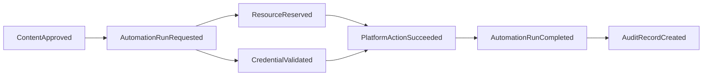
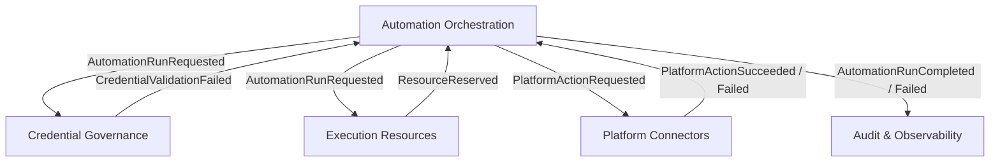

# Domain Events

## Principio

Los eventos de dominio representan hechos que ya ocurrieron. No son comandos ni solicitudes.

Se usan para desacoplar contextos y construir trazabilidad.

## Eventos del Workspace

### WorkspaceCreated

Ocurre cuando se crea un Workspace.

Consumidores posibles:

- Access & Membership para crear propietario inicial;
- Audit & Observability para registrar el origen;
- Credential Governance para inicializar politicas base.

### WorkspaceSuspended

Ocurre cuando un Workspace deja de poder operar.

Consumidores posibles:

- Automation Orchestration para detener nuevas ejecuciones;
- Execution Resources para liberar reservas;
- Audit & Observability para registrar impacto.

## Eventos de Membership

### MemberInvited

Ocurre cuando se invita a una persona a un Workspace.

### MemberRoleChanged

Ocurre cuando cambian permisos o rol de un Member.

Decision: los cambios de rol deben ser auditables porque afectan acceso a automatizaciones y credenciales.

## Eventos de Business

### BusinessCreated

Ocurre cuando se agrega un negocio al Workspace.

### BusinessPaused

Ocurre cuando se pausa un negocio.

Consumidores posibles:

- Automation Orchestration para suspender automatizaciones asociadas;
- Content & Campaign Planning para evitar nuevas programaciones activas.

## Eventos de Credential Governance

### CredentialRegistered

Ocurre cuando se registra una credencial gobernada.

### CredentialRevoked

Ocurre cuando una credencial deja de estar disponible.

Consumidores posibles:

- Automation Orchestration para bloquear ejecuciones dependientes;
- Audit & Observability para registrar el cambio.

### CredentialValidationFailed

Ocurre cuando una validacion falla.

Decision: no significa necesariamente incidente; puede ser expiracion, revocacion externa o error de proveedor.

## Eventos de Content & Campaign Planning

### CampaignCreated

Ocurre cuando se crea una campana.

### ContentSubmittedForApproval

Ocurre cuando una pieza entra a revision.

### ContentApproved

Ocurre cuando una pieza queda lista para automatizacion productiva.

Consumidores posibles:

- Automation Orchestration para permitir scheduling;
- Audit & Observability para registrar aprobacion.

### ContentRejected

Ocurre cuando una pieza no puede avanzar.

## Eventos de Automation Orchestration

### AutomationCreated

Ocurre cuando se define una nueva automatizacion.

### AutomationEnabled

Ocurre cuando una automatizacion queda disponible para ejecucion.

### AutomationRunRequested

Ocurre cuando se solicita una ejecucion concreta.

### AutomationRunStarted

Ocurre cuando comienza una ejecucion.

### AutomationStepCompleted

Ocurre cuando se completa un paso.

### AutomationRunFailed

Ocurre cuando una ejecucion falla.

Consumidores posibles:

- Audit & Observability para generar reporte;
- Execution Resources para liberar reservas;
- Credential Governance si el fallo apunta a credenciales;
- AI Agent Governance si el fallo ocurre en decision de IA.

### AutomationRunCompleted

Ocurre cuando una ejecucion termina correctamente.

## Eventos de Execution Resources

### ResourceReserved

Ocurre cuando una VM, proxy, navegador o Android queda reservado para una ejecucion.

### ResourceReleased

Ocurre cuando termina la reserva.

### ResourceHealthChanged

Ocurre cuando cambia la salud operativa del recurso.

Decision: la salud de recursos debe influir en futuras automatizaciones sin acoplar cada worker al inventario tecnico.

## Eventos de AI Agent Governance

### AgentCreated

Ocurre cuando se crea un agente de IA.

### AgentPolicyChanged

Ocurre cuando cambian sus permisos, herramientas o limites.

### AgentRunCompleted

Ocurre cuando una ejecucion de IA termina.

### AgentRunFlagged

Ocurre cuando una salida de IA requiere revision.

Decision: la IA debe dejar eventos explicables porque puede influir en contenido, respuestas o decisiones operativas.

## Eventos de Platform Connectors

### PlatformActionRequested

Ocurre cuando el dominio solicita una accion externa.

### PlatformActionSucceeded

Ocurre cuando una plataforma confirma una accion.

### PlatformActionFailed

Ocurre cuando una plataforma rechaza o falla una accion.

Decision: el dominio no debe depender de detalles exactos de cada API externa. El conector traduce esos detalles a eventos internos.

## Eventos de Audit & Observability

### AuditRecordCreated

Ocurre cuando se registra un hecho auditable.

### FailureReportCreated

Ocurre cuando un fallo requiere investigacion.

## Flujo de eventos

## Relacion evento-contexto

## Nota importante

Los eventos descritos aqui son modelo de dominio. No definen colas, topicos, tablas, tecnologias ni payloads concretos.
