# RFC-0001: RRSS AUTO Execution Engine

## Estado

Propuesto como fundamento arquitectonico.

## Resumen

El producto real de RRSS AUTO es el `Execution Engine`.

Las integraciones, navegadores, agentes de IA, maquinas virtuales, proxies y plataformas externas son capacidades. Ninguna de ellas debe definir el modelo operativo central.

Toda automatizacion futura debe convertirse en una `Execution`.

El Execution Engine es responsable de:

- aceptar intenciones de ejecucion;
- planificarlas;
- asignar recursos;
- coordinar workers;
- controlar estados;
- aplicar reintentos;
- garantizar idempotencia;
- recuperar fallos;
- emitir eventos;
- conservar trazabilidad.

## Objetivo de escala

El diseno debe soportar 1000 ejecuciones concurrentes.

Esto no significa que una unica maquina deba ejecutar todo. Significa que el modelo debe permitir distribucion horizontal, particionamiento por Workspace, control de recursos y backpressure.

## Principio central

Una Execution es una unidad operacional auditable, idempotente y recuperable.

No se debe ejecutar nada importante fuera del Execution Engine.

## Conceptos principales

### Execution

Instancia concreta de trabajo que el sistema debe realizar.

Una Execution representa "algo que debe ocurrir" bajo reglas de Workspace, politica, recursos e idempotencia.

### Execution Plan

Descripcion ordenada y validada de los pasos que una Execution debe seguir.

El plan no ejecuta. El plan permite controlar, auditar y reanudar.

### Execution Step

Unidad atomica de avance dentro de una Execution.

Un Step debe tener estado propio para permitir reintentos parciales, recuperacion y diagnostico.

### Job

Representacion planificable de trabajo pendiente.

Un Job es lo que el Scheduler y las colas entienden. Una Execution puede producir uno o varios Jobs segun su tipo.

### Worker

Proceso ejecutor que toma Jobs, reserva recursos, ejecuta Steps y reporta eventos.

Un Worker no decide politicas globales. Ejecuta segun contrato del Engine.

### Resource Lease

Reserva temporal de un recurso necesario para ejecutar.

Puede representar VM, proxy, agente IA, perfil de navegador, dispositivo, cuota externa u otro recurso futuro.

### Capability

Habilidad ejecutable conectada al Engine.

Ejemplos futuros: IA, navegador, VM, proxy, plataforma externa. El Engine no debe depender del detalle interno de la capability.

## Modelo de alto nivel

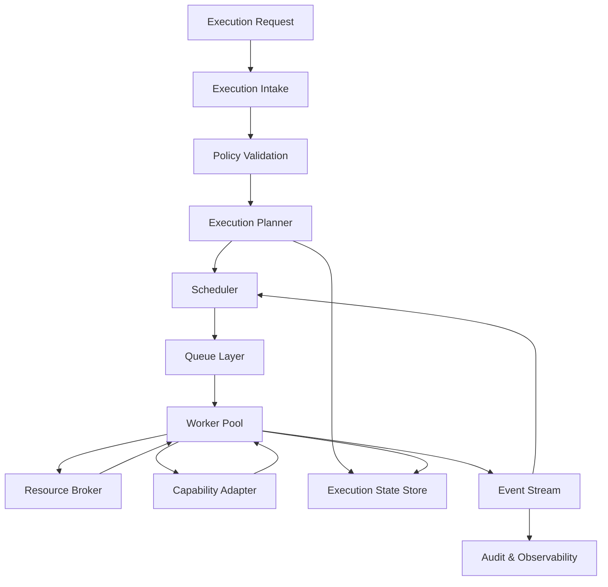
```mermaid
flowchart TB
  Request["Execution Request"]
  Intake["Execution Intake"]
  Policy["Policy Validation"]
  Planner["Execution Planner"]
  Scheduler["Scheduler"]
  Queue["Queue Layer"]
  Worker["Worker Pool"]
  ResourceBroker["Resource Broker"]
  Capability["Capability Adapter"]
  StateStore["Execution State Store"]
  EventBus["Event Stream"]
  Audit["Audit & Observability"]

  Request --> Intake
  Intake --> Policy
  Policy --> Planner
  Planner --> StateStore
  Planner --> Scheduler
  Scheduler --> Queue
  Queue --> Worker
  Worker --> ResourceBroker
  ResourceBroker --> Worker
  Worker --> Capability
  Capability --> Worker
  Worker --> StateStore
  Worker --> EventBus
  EventBus --> Audit
  EventBus --> Scheduler
```

## Decision: Engine antes que capacidades

El Engine se disena antes que cualquier plataforma concreta porque las capacidades cambiaran con el tiempo.

Si el dominio se acopla a una plataforma, cada nueva capacidad obliga a redisenar. Si todo pasa por Execution, cada capacidad se conecta como adaptador y respeta el mismo ciclo de vida.

## Ciclo de vida de una Execution

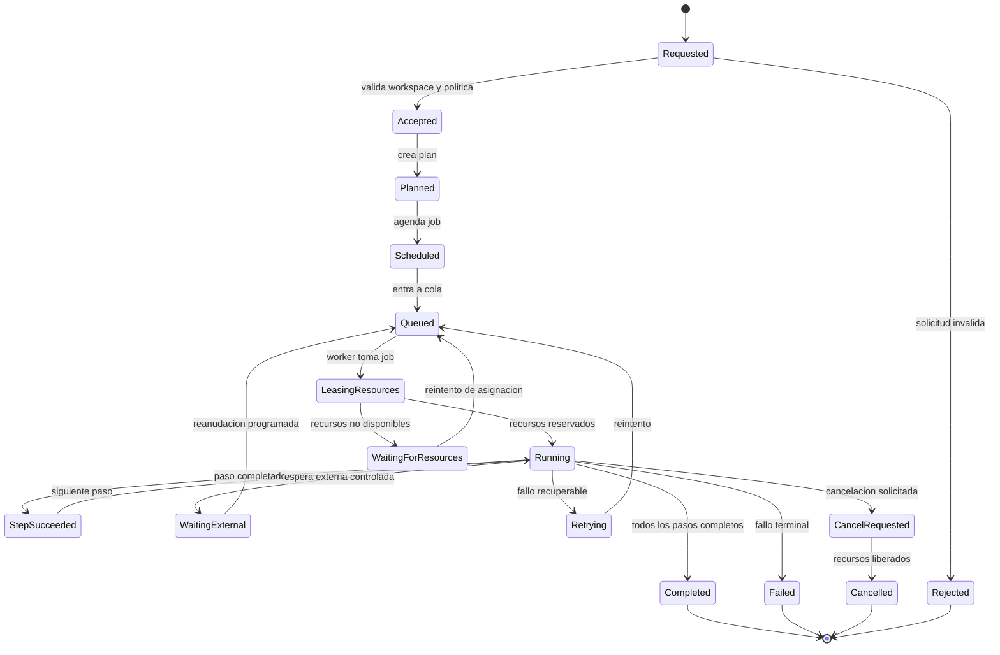
```mermaid
stateDiagram-v2
  [*] --> Requested
  Requested --> Accepted: valida workspace y politica
  Requested --> Rejected: solicitud invalida

  Accepted --> Planned: crea plan
  Planned --> Scheduled: agenda job
  Scheduled --> Queued: entra a cola
  Queued --> LeasingResources: worker toma job
  LeasingResources --> Running: recursos reservados
  LeasingResources --> WaitingForResources: recursos no disponibles
  WaitingForResources --> Queued: reintento de asignacion

  Running --> StepSucceeded: paso completado
  StepSucceeded --> Running: siguiente paso
  Running --> WaitingExternal: espera externa controlada
  WaitingExternal --> Queued: reanudacion programada

  Running --> Retrying: fallo recuperable
  Retrying --> Queued: reintento
  Running --> Failed: fallo terminal
  Running --> CancelRequested: cancelacion solicitada
  CancelRequested --> Cancelled: recursos liberados
  Running --> Completed: todos los pasos completos

  Completed --> [*]
  Failed --> [*]
  Cancelled --> [*]
  Rejected --> [*]
```

## Estados de Execution

### Requested

La ejecucion fue solicitada, pero aun no fue aceptada.

Decision: separar Requested de Accepted permite rechazar temprano sin crear trabajo operacional.

### Accepted

La solicitud paso validaciones iniciales de Workspace, permisos y politicas.

### Planned

Existe un plan de pasos y recursos potenciales.

Decision: el plan debe existir antes de entrar a cola para que la ejecucion sea explicable.

### Scheduled

La ejecucion tiene una ventana o prioridad de ejecucion.

### Queued

La ejecucion esta esperando que un Worker la tome.

### LeasingResources

El Worker intenta reservar recursos.

Decision: la reserva de recursos es estado explicito porque, a escala, la falta de VM, proxy o cuota IA sera normal.

### WaitingForResources

No hay recursos disponibles, pero la ejecucion sigue siendo valida.

### Running

La ejecucion esta avanzando.

### WaitingExternal

La ejecucion espera una condicion externa, cooldown, callback, ventana horaria o recurso diferido.

### Retrying

La ejecucion fallo de forma recuperable y se preparo para reintento.

### Completed

La ejecucion termino correctamente.

### Failed

La ejecucion termino con fallo terminal.

### Cancelled

La ejecucion fue cancelada y sus recursos fueron liberados.

### Rejected

La ejecucion nunca fue aceptada.

## Ciclo de vida de Job

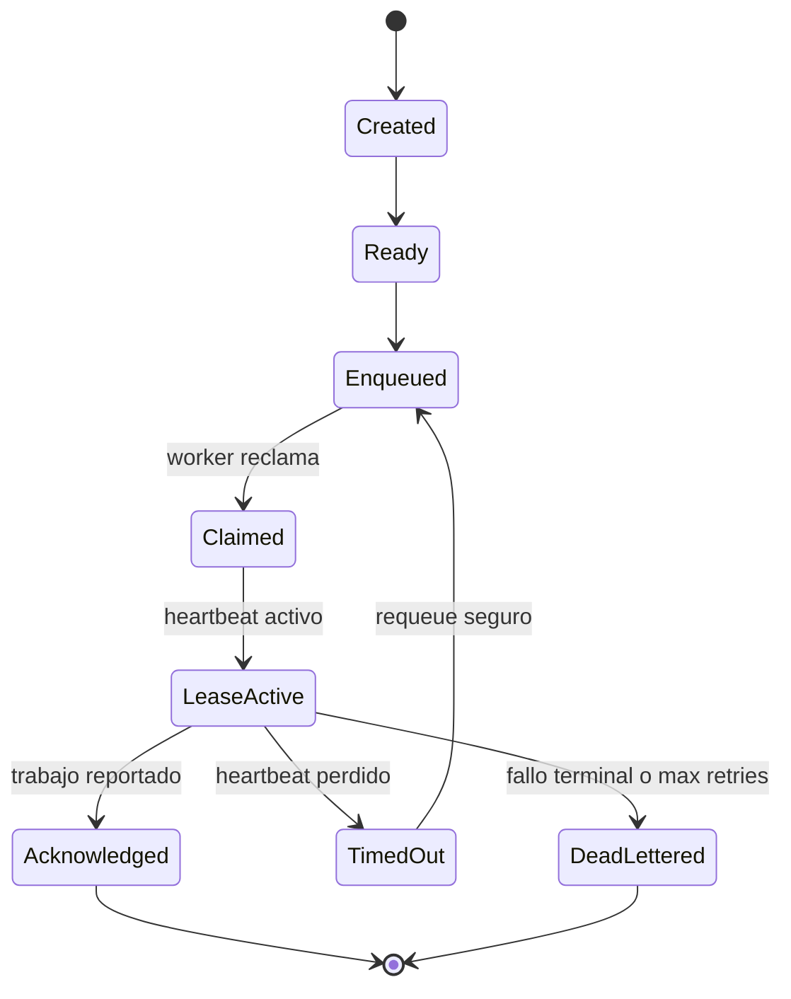
```mermaid
stateDiagram-v2
  [*] --> Created
  Created --> Ready
  Ready --> Enqueued
  Enqueued --> Claimed: worker reclama
  Claimed --> LeaseActive: heartbeat activo
  LeaseActive --> Acknowledged: trabajo reportado
  LeaseActive --> TimedOut: heartbeat perdido
  TimedOut --> Enqueued: requeue seguro
  LeaseActive --> DeadLettered: fallo terminal o max retries
  Acknowledged --> [*]
  DeadLettered --> [*]
```

## Decision: separar Execution y Job

Execution es concepto de dominio operacional.

Job es concepto de scheduling y cola.

Esta separacion permite que:

- una Execution larga se divida en varios Jobs;
- un Job fallido no destruya la historia de la Execution;
- el Scheduler reprograme trabajo sin cambiar la intencion original;
- el Engine soporte esperas, reanudaciones y pasos asincronos.

## Ciclo de vida de Worker

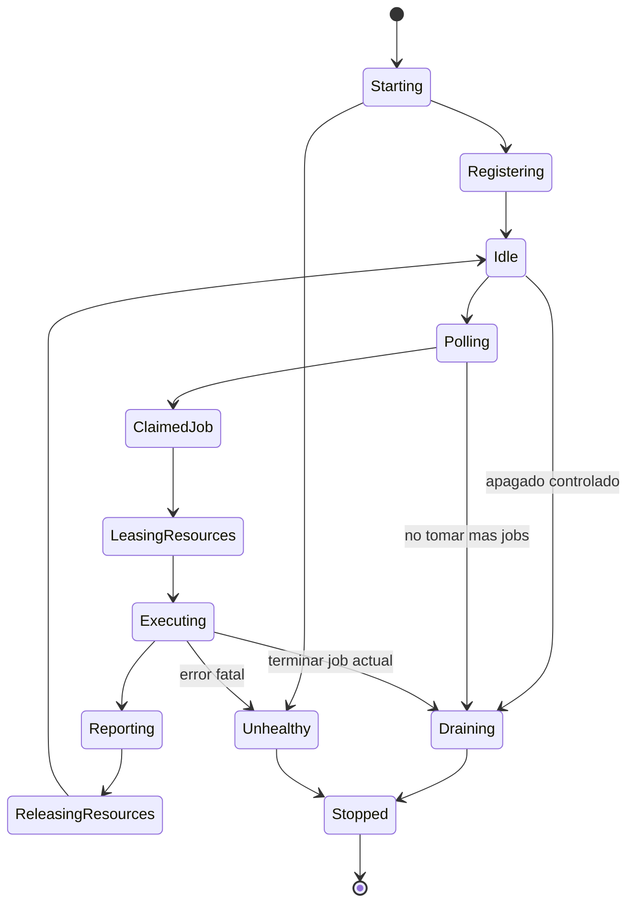
```mermaid
stateDiagram-v2
  [*] --> Starting
  Starting --> Registering
  Registering --> Idle
  Idle --> Polling
  Polling --> ClaimedJob
  ClaimedJob --> LeasingResources
  LeasingResources --> Executing
  Executing --> Reporting
  Reporting --> ReleasingResources
  ReleasingResources --> Idle

  Idle --> Draining: apagado controlado
  Polling --> Draining: no tomar mas jobs
  Executing --> Draining: terminar job actual
  Draining --> Stopped
  Starting --> Unhealthy
  Executing --> Unhealthy: error fatal
  Unhealthy --> Stopped
  Stopped --> [*]
```

## Responsabilidades del Worker

El Worker debe:

- registrarse con sus capacidades;
- tomar trabajo compatible;
- emitir heartbeats;
- reservar recursos mediante el Resource Broker;
- ejecutar pasos;
- reportar eventos;
- liberar recursos;
- detenerse de forma controlada.

El Worker no debe:

- saltarse politicas del Workspace;
- leer secretos sin autorizacion;
- decidir prioridades globales;
- modificar estados sin transicion valida;
- retener recursos despues de terminar.

## Estrategia de colas

El Queue Layer debe soportar varias colas logicas.

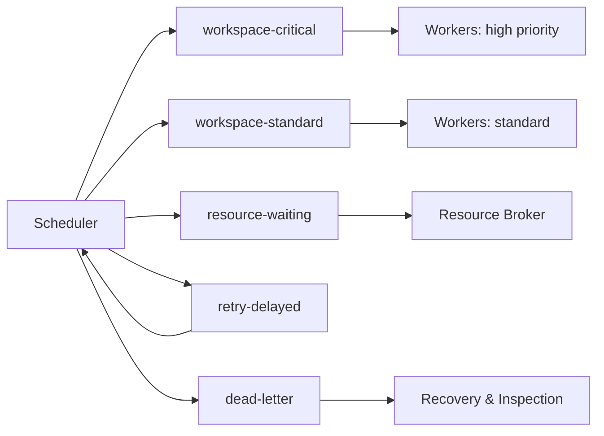
```mermaid
flowchart LR
  Scheduler["Scheduler"]

  Scheduler --> Q1["workspace-critical"]
  Scheduler --> Q2["workspace-standard"]
  Scheduler --> Q3["resource-waiting"]
  Scheduler --> Q4["retry-delayed"]
  Scheduler --> Q5["dead-letter"]

  Q1 --> WorkersA["Workers: high priority"]
  Q2 --> WorkersB["Workers: standard"]
  Q3 --> ResourceBroker["Resource Broker"]
  Q4 --> Scheduler
  Q5 --> Recovery["Recovery & Inspection"]
```

## Decision: colas por prioridad y estado, no por plataforma

Las colas no deben nombrarse por capacidades concretas.

La prioridad debe responder a:

- criticidad;
- Workspace;
- disponibilidad de recursos;
- ventana temporal;
- reintentos;
- tipo de carga.

Si se crean colas por plataforma, el sistema queda acoplado a integraciones externas. Si se crean colas por comportamiento operacional, nuevas capacidades pueden entrar sin redisenar el Engine.

## Scheduler

El Scheduler decide cuando un Job puede entrar a cola.

Responsabilidades:

- respetar ventanas horarias;
- aplicar prioridades;
- evitar duplicados;
- aplicar rate limits;
- detectar ejecuciones pausadas;
- reactivar esperas;
- mover reintentos diferidos;
- aplicar fairness entre Workspaces.

## Fairness multi-tenant

Para 1000 ejecuciones concurrentes, el Scheduler debe evitar que un Workspace consuma toda la capacidad.

Modelo recomendado:

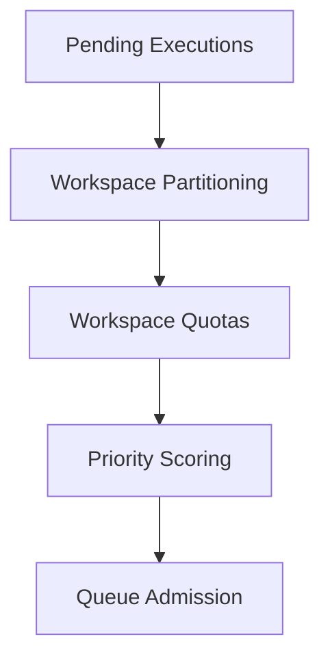
```mermaid
flowchart TB
  Pending["Pending Executions"]
  Partition["Workspace Partitioning"]
  Quota["Workspace Quotas"]
  Priority["Priority Scoring"]
  Enqueue["Queue Admission"]

  Pending --> Partition
  Partition --> Quota
  Quota --> Priority
  Priority --> Enqueue
```

Decision: la justicia entre Workspaces se resuelve antes de entrar a cola. Asi los Workers no necesitan conocer reglas complejas de negocio.

## State Machine

El Execution Engine debe tener una maquina de estados estricta.

Reglas:

- toda transicion debe ser valida;
- toda transicion debe emitir evento;
- toda transicion debe ser auditable;
- toda transicion debe ser idempotente;
- los estados terminales no se modifican semanticamente.

## Transiciones principales

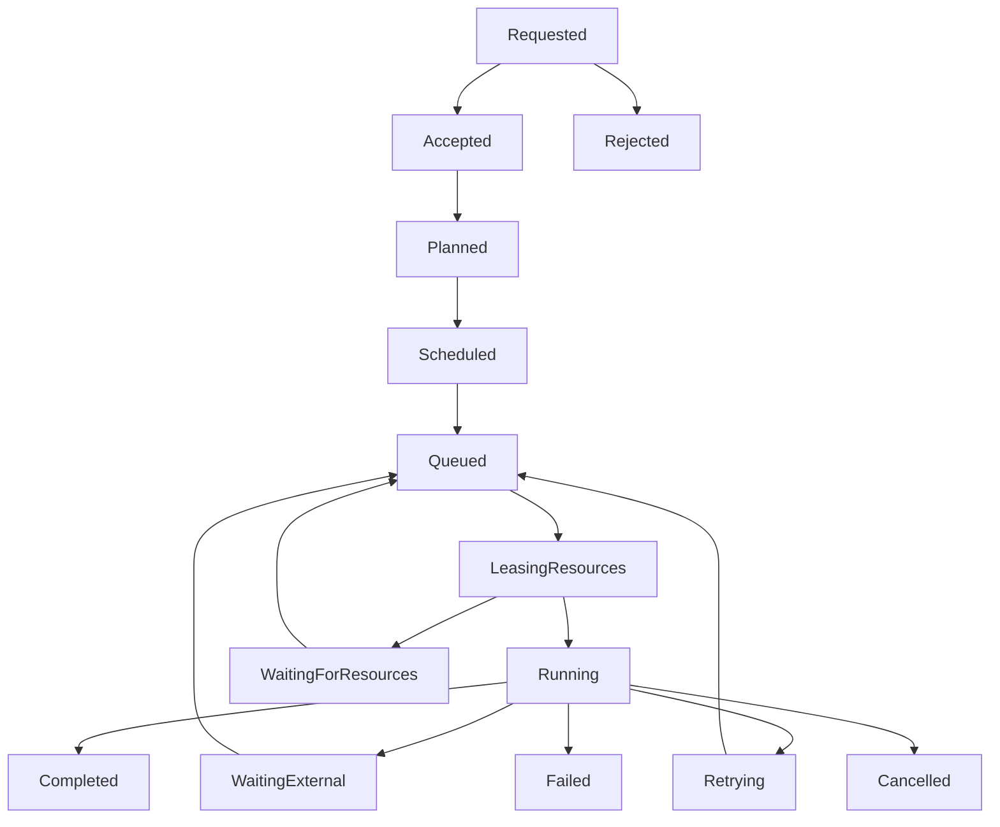
```mermaid
flowchart TB
  Requested --> Accepted
  Requested --> Rejected
  Accepted --> Planned
  Planned --> Scheduled
  Scheduled --> Queued
  Queued --> LeasingResources
  LeasingResources --> Running
  LeasingResources --> WaitingForResources
  WaitingForResources --> Queued
  Running --> WaitingExternal
  WaitingExternal --> Queued
  Running --> Retrying
  Retrying --> Queued
  Running --> Completed
  Running --> Failed
  Running --> Cancelled
```

## Recuperacion ante fallos

Los fallos deben clasificarse antes de decidir recuperacion.

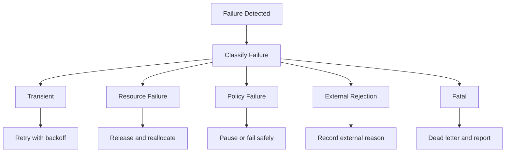
```mermaid
flowchart TB
  Failure["Failure Detected"]
  Classify["Classify Failure"]
  Transient["Transient"]
  Resource["Resource Failure"]
  Policy["Policy Failure"]
  External["External Rejection"]
  Fatal["Fatal"]

  Failure --> Classify
  Classify --> Transient
  Classify --> Resource
  Classify --> Policy
  Classify --> External
  Classify --> Fatal

  Transient --> Retry["Retry with backoff"]
  Resource --> Reallocate["Release and reallocate"]
  Policy --> Pause["Pause or fail safely"]
  External --> Inspect["Record external reason"]
  Fatal --> DeadLetter["Dead letter and report"]
```

## Tipos de fallo

### Transient Failure

Fallo temporal: timeout, saturacion, error momentaneo.

Accion: reintento con backoff.

### Resource Failure

La VM, proxy, agente, perfil o cuota no esta disponible.

Accion: liberar recurso, marcar salud, reintentar con otro recurso.

### Policy Failure

La ejecucion ya no cumple reglas.

Accion: pausar o fallar sin reintentar automaticamente.

### External Rejection

Un sistema externo rechaza la accion.

Accion: registrar causa, evitar reintentos peligrosos si la respuesta indica rechazo definitivo.

### Fatal Failure

Error no recuperable o inconsistencia.

Accion: dead-letter, reporte y revision.

## Estrategia de retry

Los reintentos deben ser politicas, no reflejos automaticos.

Parametros conceptuales:

- max attempts;
- exponential backoff;
- jitter;
- retry window;
- failure class;
- resource replacement;
- idempotency key;
- cooldown por Workspace;
- cooldown por recurso.

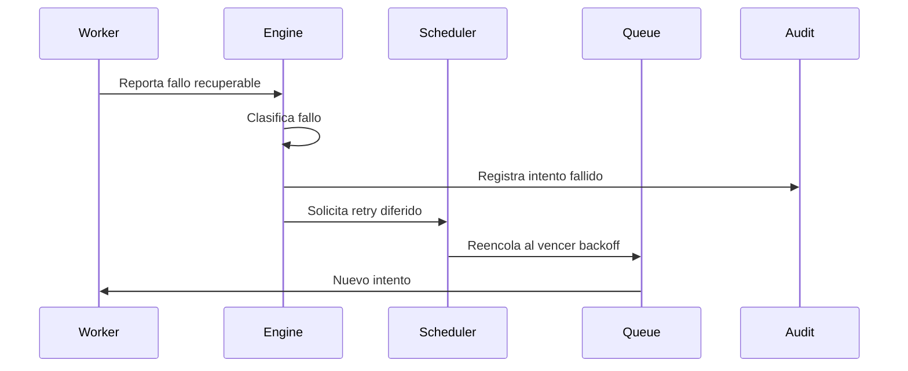
```mermaid
sequenceDiagram
  participant Worker
  participant Engine
  participant Scheduler
  participant Queue
  participant Audit

  Worker->>Engine: Reporta fallo recuperable
  Engine->>Engine: Clasifica fallo
  Engine->>Audit: Registra intento fallido
  Engine->>Scheduler: Solicita retry diferido
  Scheduler->>Queue: Reencola al vencer backoff
  Queue->>Worker: Nuevo intento
```

## Decision: reintentos con jitter

El jitter evita que muchas ejecuciones fallen y reintenten al mismo tiempo. Para 1000 ejecuciones concurrentes, esto es obligatorio para no crear tormentas de reintentos.

## Idempotencia

Cada Execution debe tener una clave de idempotencia.

Cada Step que pueda causar efecto externo debe tener su propia clave de idempotencia.

## Reglas de idempotencia

- una misma solicitud no debe crear ejecuciones duplicadas;
- un Step repetido no debe duplicar efectos externos si ya fue confirmado;
- un Worker que pierde heartbeat puede ser reemplazado sin ejecutar dos veces efectos peligrosos;
- los resultados deben poder reconciliarse.

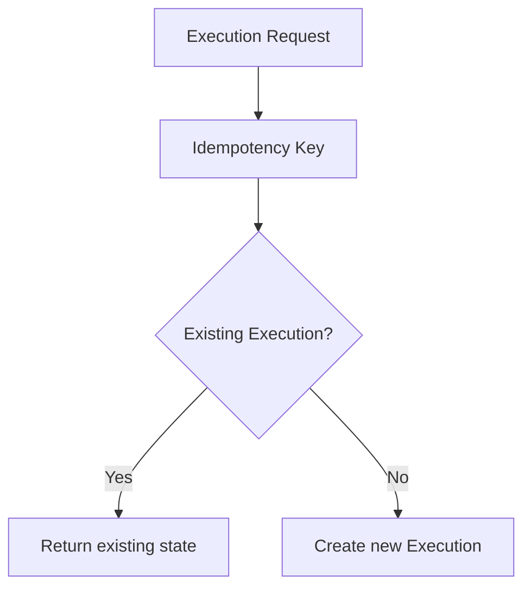
```mermaid
flowchart TB
  Request["Execution Request"]
  Key["Idempotency Key"]
  Existing{"Existing Execution?"}
  ReturnExisting["Return existing state"]
  Create["Create new Execution"]

  Request --> Key
  Key --> Existing
  Existing -->|Yes| ReturnExisting
  Existing -->|No| Create
```

## Decision: idempotencia por Execution y por Step

La idempotencia solo a nivel de Execution es insuficiente. Una Execution larga puede fallar en el paso 8 de 10. El Engine debe saber que pasos ya produjeron efectos.

## Ejecucion distribuida

El Engine debe asumir que:

- hay multiples Workers;
- un Worker puede morir;
- una red puede dividirse;
- un Job puede entregarse mas de una vez;
- un recurso puede quedar bloqueado;
- un evento puede llegar tarde;
- una Execution puede esperar mucho tiempo.

## Modelo distribuido

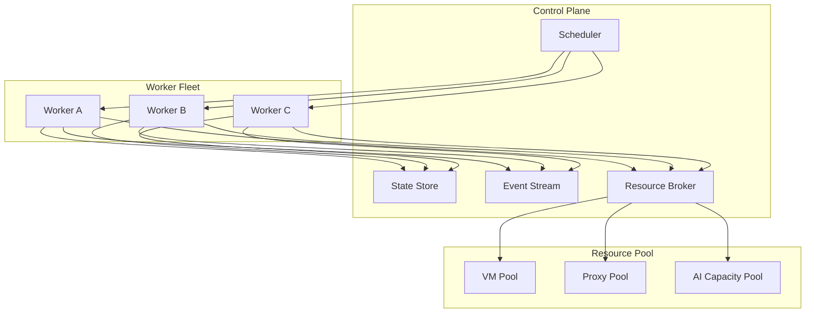
```mermaid
flowchart TB
  subgraph ControlPlane["Control Plane"]
    Scheduler
    StateStore["State Store"]
    EventStream["Event Stream"]
    ResourceBroker["Resource Broker"]
  end

  subgraph Workers["Worker Fleet"]
    W1["Worker A"]
    W2["Worker B"]
    W3["Worker C"]
  end

  subgraph Resources["Resource Pool"]
    VM["VM Pool"]
    Proxy["Proxy Pool"]
    AI["AI Capacity Pool"]
  end

  Scheduler --> W1
  Scheduler --> W2
  Scheduler --> W3
  W1 --> ResourceBroker
  W2 --> ResourceBroker
  W3 --> ResourceBroker
  ResourceBroker --> VM
  ResourceBroker --> Proxy
  ResourceBroker --> AI
  W1 --> StateStore
  W2 --> StateStore
  W3 --> StateStore
  W1 --> EventStream
  W2 --> EventStream
  W3 --> EventStream
```

## Decision: Control Plane separado de Worker Fleet

El Control Plane mantiene decisiones de estado, agenda, eventos y recursos.

La Worker Fleet ejecuta trabajo.

Esta separacion permite escalar workers horizontalmente sin duplicar la logica de gobierno.

## Event Flow

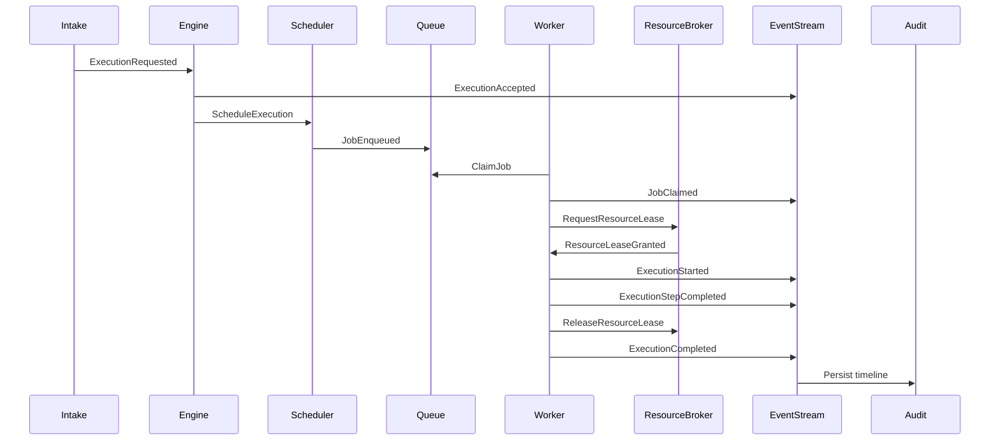
```mermaid
sequenceDiagram
  participant Intake
  participant Engine
  participant Scheduler
  participant Queue
  participant Worker
  participant ResourceBroker
  participant EventStream
  participant Audit

  Intake->>Engine: ExecutionRequested
  Engine->>EventStream: ExecutionAccepted
  Engine->>Scheduler: ScheduleExecution
  Scheduler->>Queue: JobEnqueued
  Worker->>Queue: ClaimJob
  Worker->>EventStream: JobClaimed
  Worker->>ResourceBroker: RequestResourceLease
  ResourceBroker->>Worker: ResourceLeaseGranted
  Worker->>EventStream: ExecutionStarted
  Worker->>EventStream: ExecutionStepCompleted
  Worker->>ResourceBroker: ReleaseResourceLease
  Worker->>EventStream: ExecutionCompleted
  EventStream->>Audit: Persist timeline
```

## Eventos principales

- ExecutionRequested;
- ExecutionAccepted;
- ExecutionRejected;
- ExecutionPlanned;
- ExecutionScheduled;
- JobEnqueued;
- JobClaimed;
- ResourceLeaseRequested;
- ResourceLeaseGranted;
- ResourceLeaseDenied;
- ExecutionStarted;
- ExecutionStepStarted;
- ExecutionStepCompleted;
- ExecutionStepFailed;
- ExecutionWaitingForResources;
- ExecutionRetryScheduled;
- ExecutionCompleted;
- ExecutionFailed;
- ExecutionCancelled;
- ResourceLeaseReleased;
- WorkerHeartbeatMissed;
- JobTimedOut;
- JobDeadLettered.

## Resource Allocation

El Engine no debe permitir que los Workers tomen recursos directamente.

Debe existir un `Resource Broker`.

Responsabilidades:

- conocer disponibilidad;
- aplicar politicas por Workspace;
- aplicar compatibilidad de recursos;
- crear leases temporales;
- renovar leases;
- liberar leases;
- marcar recursos degradados;
- evitar doble asignacion incompatible.

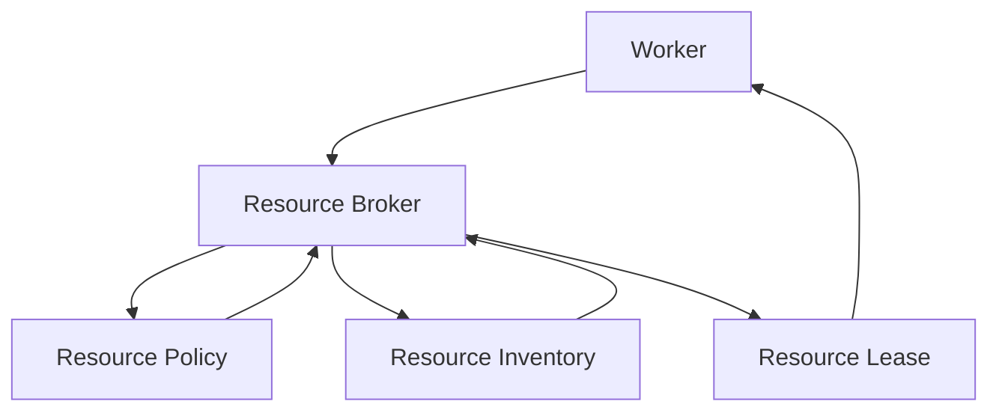
```mermaid
flowchart TB
  Worker["Worker"]
  Broker["Resource Broker"]
  Policy["Resource Policy"]
  Inventory["Resource Inventory"]
  Lease["Resource Lease"]

  Worker --> Broker
  Broker --> Policy
  Broker --> Inventory
  Policy --> Broker
  Inventory --> Broker
  Broker --> Lease
  Lease --> Worker
```

## VM Allocation

Las VMs son recursos de ejecucion de alto costo y alto aislamiento.

Modelo conceptual:

- VM disponible;
- VM reservada;
- VM en uso;
- VM drenando;
- VM en mantenimiento;
- VM fallida.

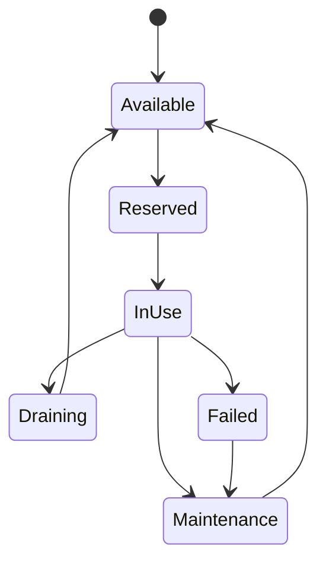
```mermaid
stateDiagram-v2
  [*] --> Available
  Available --> Reserved
  Reserved --> InUse
  InUse --> Draining
  Draining --> Available
  InUse --> Maintenance
  Maintenance --> Available
  InUse --> Failed
  Failed --> Maintenance
```

Decisiones:

- una VM no debe asignarse por acceso directo del Worker;
- la asignacion debe tener lease;
- una VM puede estar dedicada a un Workspace o compartida bajo politica;
- los artefactos de ejecucion deben poder asociarse a la VM usada;
- una VM fallida debe salir del pool automaticamente.

## Proxy Allocation

Los proxies son recursos de reputacion y red.

Modelo conceptual:

- proxy disponible;
- proxy asignado;
- proxy en cooldown;
- proxy degradado;
- proxy bloqueado.

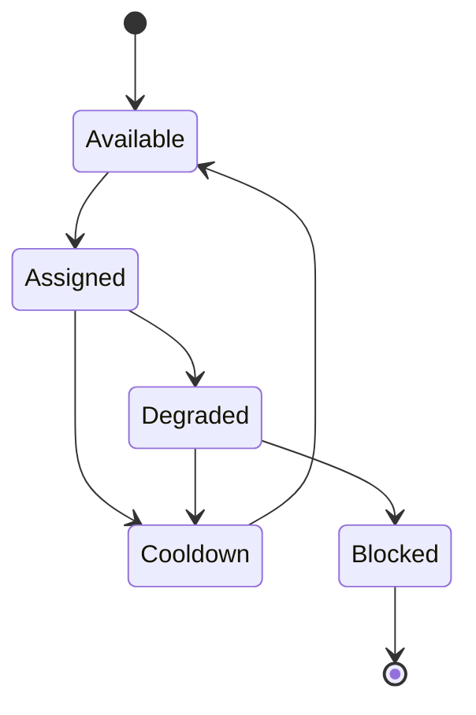
```mermaid
stateDiagram-v2
  [*] --> Available
  Available --> Assigned
  Assigned --> Cooldown
  Cooldown --> Available
  Assigned --> Degraded
  Degraded --> Cooldown
  Degraded --> Blocked
  Blocked --> [*]
```

Decisiones:

- un proxy debe asignarse respetando Workspace, Business y tipo de ejecucion;
- proxies con mala salud no deben recibir trabajo nuevo;
- cooldown evita sobreuso;
- el Engine debe tratar el proxy como recurso de dominio operativo, no como variable tecnica.

## AI Allocation

La IA es capacidad limitada, costosa y gobernada.

No se debe invocar IA directamente desde cualquier modulo. Debe pasar por asignacion del Engine cuando forma parte de una Execution.

Modelo conceptual:

- capacidad por proveedor;
- cuota por Workspace;
- politica de agente;
- limite de concurrencia;
- presupuesto;
- prioridad.

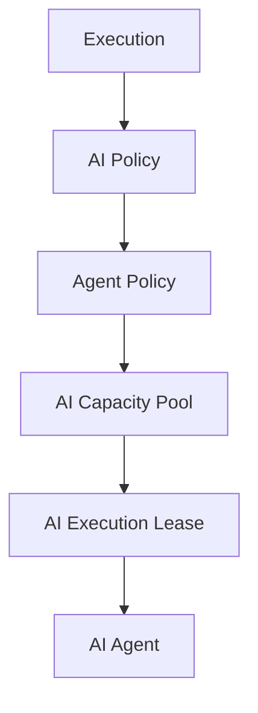
```mermaid
flowchart TB
  Execution["Execution"]
  AIPolicy["AI Policy"]
  AgentPolicy["Agent Policy"]
  Capacity["AI Capacity Pool"]
  Lease["AI Execution Lease"]
  Agent["AI Agent"]

  Execution --> AIPolicy
  AIPolicy --> AgentPolicy
  AgentPolicy --> Capacity
  Capacity --> Lease
  Lease --> Agent
```

Decisiones:

- IA debe tener quota y lease como cualquier recurso critico;
- un agente no puede exceder sus herramientas permitidas;
- la salida de IA debe convertirse en evento y artefacto auditable;
- para 1000 ejecuciones concurrentes, la IA necesita backpressure propio.

## Backpressure

Backpressure significa que el Engine puede decir "todavia no" sin fallar la ejecucion.

Se aplica cuando:

- no hay workers suficientes;
- no hay VMs;
- no hay proxies sanos;
- hay saturacion de IA;
- un Workspace excedio cuota;
- un proveedor externo esta degradado;
- el sistema esta drenando.

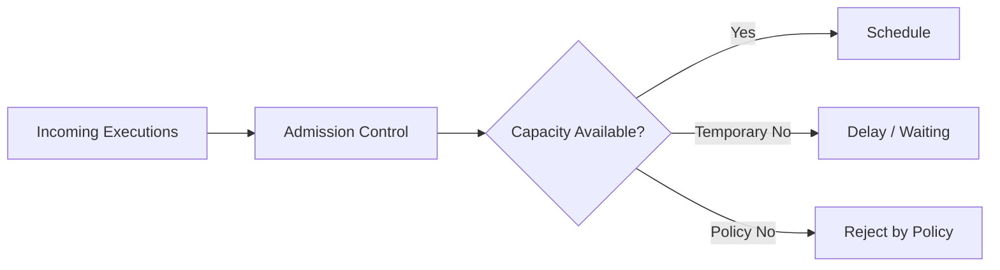
```mermaid
flowchart LR
  Load["Incoming Executions"]
  Admission["Admission Control"]
  Capacity{"Capacity Available?"}
  Admit["Schedule"]
  Delay["Delay / Waiting"]
  Reject["Reject by Policy"]

  Load --> Admission
  Admission --> Capacity
  Capacity -->|Yes| Admit
  Capacity -->|Temporary No| Delay
  Capacity -->|Policy No| Reject
```

## Decision: esperar no es fallar

En sistemas de automatizacion, falta temporal de capacidad no debe ser tratada como fallo terminal. Por eso existen estados `WaitingForResources` y `WaitingExternal`.

## Observabilidad

Cada Execution debe producir una timeline.

La timeline debe responder:

- quien solicito la ejecucion;
- que Workspace la posee;
- que politica la aprobo;
- que plan se genero;
- que Worker la tomo;
- que recursos se asignaron;
- que pasos se ejecutaron;
- que eventos ocurrieron;
- que fallo, si fallo;
- si fue reintentada;
- que artefactos produjo.

## Recovery Model

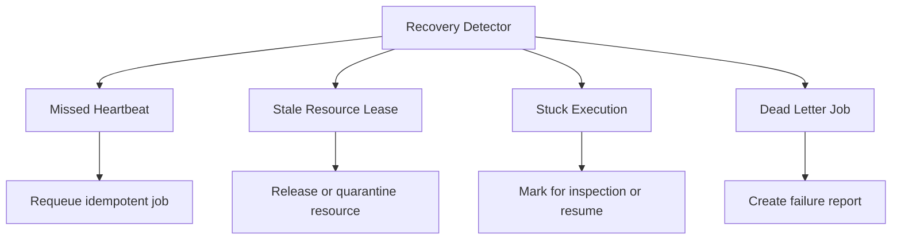
```mermaid
flowchart TB
  Detector["Recovery Detector"]
  MissedHeartbeat["Missed Heartbeat"]
  StaleLease["Stale Resource Lease"]
  StuckExecution["Stuck Execution"]
  DeadLetter["Dead Letter Job"]

  Detector --> MissedHeartbeat
  Detector --> StaleLease
  Detector --> StuckExecution
  Detector --> DeadLetter

  MissedHeartbeat --> Requeue["Requeue idempotent job"]
  StaleLease --> Release["Release or quarantine resource"]
  StuckExecution --> Inspect["Mark for inspection or resume"]
  DeadLetter --> Report["Create failure report"]
```

## Recuperacion automatica vs manual

Automatica:

- heartbeat perdido con step idempotente;
- recurso no disponible;
- timeout transitorio;
- lease vencido;
- retry dentro de politica.

Manual:

- posible duplicacion de efecto externo;
- credencial revocada;
- violacion de politica;
- inconsistencia de estado;
- dead-letter repetido;
- decision sensible de IA.

## Concurrencia de 1000 ejecuciones

Para soportar 1000 ejecuciones concurrentes, el modelo exige:

- particionamiento por Workspace;
- Worker Fleet horizontal;
- Scheduler con fairness;
- leases para recursos;
- heartbeats;
- backpressure;
- colas diferidas;
- idempotencia por Step;
- eventos asincronos;
- observabilidad por timeline;
- limites por recurso;
- recuperacion de jobs abandonados.

## Diagrama de concurrencia

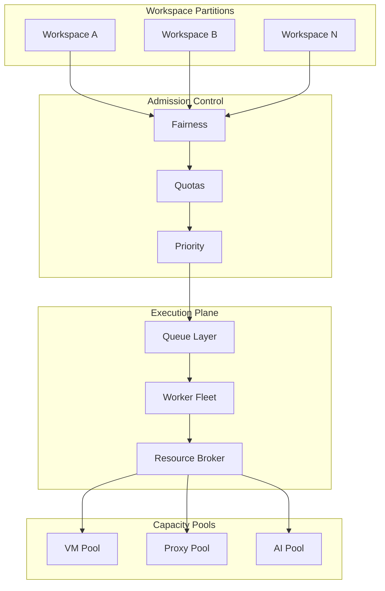
```mermaid
flowchart TB
  subgraph Workspaces["Workspace Partitions"]
    WS1["Workspace A"]
    WS2["Workspace B"]
    WS3["Workspace N"]
  end

  subgraph Admission["Admission Control"]
    Fairness["Fairness"]
    Quotas["Quotas"]
    Priority["Priority"]
  end

  subgraph Execution["Execution Plane"]
    Queues["Queue Layer"]
    Workers["Worker Fleet"]
    Broker["Resource Broker"]
  end

  subgraph Capacity["Capacity Pools"]
    VMs["VM Pool"]
    Proxies["Proxy Pool"]
    AI["AI Pool"]
  end

  WS1 --> Fairness
  WS2 --> Fairness
  WS3 --> Fairness
  Fairness --> Quotas
  Quotas --> Priority
  Priority --> Queues
  Queues --> Workers
  Workers --> Broker
  Broker --> VMs
  Broker --> Proxies
  Broker --> AI
```

## Reglas arquitectonicas no negociables

1. Nada importante se ejecuta fuera del Execution Engine.
2. Toda automatizacion se convierte en Execution.
3. Toda Execution pertenece a un Workspace.
4. Toda Execution tiene estado explicito.
5. Todo Step con efecto externo debe ser idempotente.
6. Todo Worker debe emitir heartbeat.
7. Todo recurso critico se asigna mediante lease.
8. Todo fallo debe clasificarse.
9. Todo retry debe obedecer politica.
10. Todo estado terminal debe ser auditable.
11. Toda capacidad externa entra como adapter, no como regla central.
12. La falta temporal de recursos debe producir espera, no caos.

## Decisiones clave

### 1. Execution como unidad central

Por que: permite que cualquier automatizacion futura use el mismo ciclo de vida.

Como consecuencia: Instagram, IA, VMs o cualquier capacidad futura no definen su propio runtime.

### 2. Execution separada de Job

Por que: una Execution puede vivir mas que un Job, esperar, reanudarse o dividirse en pasos.

Como consecuencia: el Scheduler puede operar sin destruir el historial de dominio.

### 3. Resource Broker obligatorio

Por que: workers distribuidos no deben competir directamente por recursos sensibles.

Como consecuencia: VMs, proxies e IA se asignan de forma consistente y auditable.

### 4. State machine estricta

Por que: sin estados formales, la recuperacion de fallos se vuelve ambigua.

Como consecuencia: cada transicion debe ser valida, registrada e idempotente.

### 5. Idempotencia granular

Por que: a escala, los jobs pueden repetirse.

Como consecuencia: cada Step con efecto externo necesita identidad propia.

### 6. Backpressure como comportamiento normal

Por que: 1000 ejecuciones concurrentes pueden superar recursos disponibles.

Como consecuencia: el Engine debe demorar, pausar o reprogramar antes que fallar innecesariamente.

### 7. Observabilidad por timeline

Por que: las automatizaciones distribuidas son imposibles de operar sin historia completa.

Como consecuencia: cada Execution debe ser investigable de punta a punta.

## Fuera de alcance

Este RFC no define:

- codigo;
- APIs;
- SQL;
- tecnologia de cola;
- Docker;
- nombres de tablas;
- conectores concretos;
- proveedores de IA;
- implementacion de Playwright;
- detalles de VMware;
- proveedores de proxies.

## Resultado esperado

RFC-0001 debe ser la base para disenar casos de uso, workers, colas, recursos, observabilidad y futuras implementaciones.

Antes de implementar cualquier automatizacion, se debe responder como encaja en:

- Execution;
- Execution Plan;
- Job;
- Worker;
- Resource Lease;
- State Machine;
- Events;
- Recovery;
- Observability.
