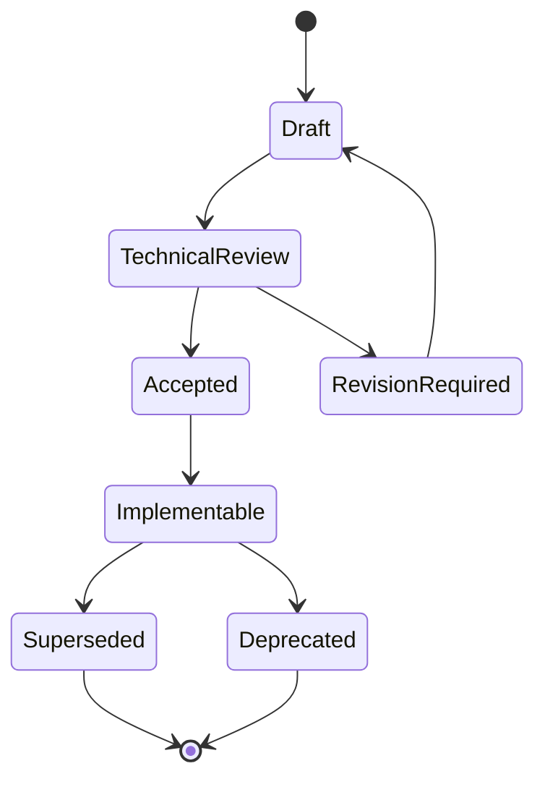

# Engineering Specifications

Las Engineering Specifications convierten RFCs, ADRs y Blueprints en contratos tecnicos de alto nivel para equipos senior de implementacion.

No son codigo. No definen APIs, SQL, Docker, clases ni frameworks. Definen responsabilidades, limites, contratos, estados, invariantes, fallos, recuperacion y criterios de observabilidad que cualquier implementacion debe cumplir.

## Purpose

El proposito de esta carpeta es reducir ambiguedad antes de implementar subsistemas criticos.

Una especificacion debe responder:

- que problema resuelve el subsistema;
- que no debe resolver;
- que contratos ofrece;
- que consumidores y proveedores participan;
- que estados y transiciones son validos;
- como se recupera de fallos;
- como protege Workspace isolation;
- como se observa y opera en produccion.

## Lifecycle

## Specification standards

Toda especificacion debe:

- respetar Workspace como concepto superior;
- mantener arquitectura limpia;
- distinguir responsabilidades y no-responsabilidades;
- declarar invariantes;
- definir contratos internos y externos sin describir endpoints;
- incluir diagramas Mermaid;
- documentar escenarios de fallo y recuperacion;
- declarar observabilidad, metricas y seguridad;
- referenciar RFCs, ADRs y Blueprints relacionados;
- documentar preguntas abiertas en vez de inventar implementacion.

## Relationship with RFC

Los RFCs definen arquitectura fundacional.

Las especificaciones explican como un subsistema debe comportarse dentro de esa arquitectura.

Ejemplo: `RFC-0001` define que los recursos se asignan mediante leases y un Resource Broker. `SPEC-0001` detalla el comportamiento esperado del Resource Manager que hace posible esa capacidad.

## Relationship with ADR

Las ADRs registran decisiones aceptadas.

Las especificaciones no pueden contradecir ADRs. Si una especificacion necesita cambiar una decision, primero debe proponerse una nueva ADR.

## Relationship with Blueprints

Los Blueprints describen flujos de negocio.

Las especificaciones convierten esos flujos en contratos de plataforma que los equipos pueden implementar.

Ejemplo: los Blueprints de provision de VM, asignacion de proxy y ciclo de Execution son entradas directas para `SPEC-0001`.

## Implementation workflow

1. Leer README, PROJECT, Architecture, DDD, ADRs, RFCs, Blueprints y Specifications relevantes.
2. Identificar el limite del subsistema.
3. Confirmar invariantes y contratos.
4. Disenar implementacion sin saltarse la especificacion.
5. Si aparece una ambiguedad, documentarla o proponer actualizacion.
6. Implementar en el modulo correcto.
7. Verificar que observabilidad, seguridad y recuperacion esten cubiertas.

## Specifications actuales

- `SPEC-0001-resource-manager.md`
