# SPEC-0001: Resource Manager

## Status

Draft for engineering review.

## Mission

Resource Manager gobierna recursos operativos asignables dentro de RRSS AUTO.

Su mision es mantener inventario, estado, salud, capacidad, reservas y leases de recursos criticos para que el Execution Engine pueda ejecutar de forma segura, auditable y aislada por Workspace.

Resource Manager no ejecuta automatizaciones. No decide que trabajo debe hacerse. No reemplaza al Execution Engine. Su rol es responder si un recurso puede ser reservado, bajo que condiciones, por cuanto tiempo y con que garantias de aislamiento.

## Why this exists

RRSS AUTO operara Workspaces con VMs, proxies, perfiles de navegador, dispositivos Android, capacidad de IA y otros recursos futuros.

Estos recursos tienen riesgo operacional:

- pueden agotarse;
- pueden fallar;
- pueden quedar bloqueados;
- pueden contaminarse entre Workspaces;
- pueden quedar en uso despues de un fallo;
- pueden producir duplicacion si dos Workers los usan al mismo tiempo;
- pueden afectar seguridad, reputacion y costo.

Por eso el sistema necesita un Resource Manager centralizado conceptualmente, aunque su implementacion futura pueda estar distribuida.

## Architectural position

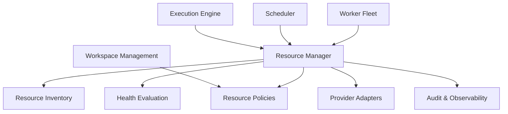

Decision: Resource Manager esta entre el Execution Engine y los recursos. Los Workers nunca deben apropiarse directamente de recursos criticos.

## Responsibilities

Resource Manager debe:

- mantener el inventario conceptual de recursos asignables;
- validar que un recurso pertenece o esta permitido para un Workspace;
- aplicar politicas de aislamiento;
- aplicar cuotas y limites de capacidad;
- seleccionar candidatos elegibles;
- crear reservas;
- convertir reservas en leases;
- renovar leases activos;
- liberar recursos;
- marcar recursos degradados, bloqueados, fallidos o en mantenimiento;
- emitir eventos auditables;
- informar capacidad al Scheduler;
- soportar backpressure;
- prevenir doble asignacion incompatible;
- detectar leases vencidos;
- recuperar recursos abandonados;
- preservar trazabilidad por Workspace, Execution y recurso.

## Non-responsibilities

Resource Manager no debe:

- ejecutar Steps;
- decidir prioridad global de Executions;
- crear Executions;
- programar Jobs;
- invocar capabilities externas para realizar acciones de negocio;
- almacenar secretos en claro;
- definir reglas editoriales, comerciales o de campanas;
- reemplazar Credential Governance;
- reemplazar Audit & Observability;
- asignar infraestructura a Businesses como propietarios;
- conocer detalles especificos de Instagram, Facebook, TikTok, WhatsApp, Google, LinkedIn u otras plataformas;
- exponer contratos de bajo nivel como verdad de dominio.

Decision: estas no-responsabilidades evitan que Resource Manager se convierta en un objeto central demasiado acoplado.

## Business invariants

1. Todo recurso operativo pertenece a un Workspace o a un pool gobernado explicitamente por politica de Workspace.
2. Un Business nunca posee infraestructura.
3. Un recurso no puede ser usado por una Execution sin lease valido.
4. Un lease pertenece a un Workspace.
5. Un lease debe estar asociado a una Execution o a una operacion administrativa auditada.
6. Un recurso bloqueado no puede asignarse.
7. Un recurso degradado solo puede asignarse si la politica lo permite explicitamente.
8. Un recurso en cooldown no puede asignarse hasta que la politica lo libere.
9. Un recurso no puede tener leases incompatibles simultaneos.
10. Toda transicion relevante debe emitir evento.
11. Toda liberacion debe ser idempotente.
12. Toda reserva debe vencer si no se convierte en lease.
13. Resource Manager debe preferir esperar antes que fallar cuando la falta de capacidad es temporal.
14. Un Workspace suspendido no puede recibir nuevos leases productivos.
15. Resource Manager no puede cruzar recursos entre Workspaces sin politica explicita y auditable.

## Module boundaries

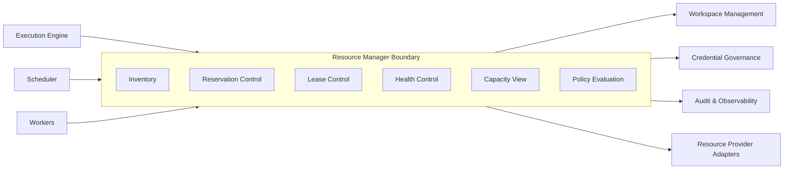

## Boundary decisions

Resource Manager owns:

- resource state;
- reservation state;
- lease state;
- capacity view;
- health status as interpreted for allocation;
- resource assignment policies;
- resource usage events.

Resource Manager consumes:

- Workspace status;
- Workspace limits;
- Execution requirements;
- credential availability signal when a resource requires secret-backed access;
- provider health signals;
- operational policies.

Resource Manager publishes:

- resource availability;
- lease results;
- capacity pressure;
- resource health changes;
- allocation failures;
- recovery events.

## Resource categories

Initial categories:

- Virtual Machine;
- Residential Proxy;
- AI Capacity;
- Browser Profile;
- Android Device.

Future categories:

- network region capacity;
- storage workspace;
- external provider quota;
- human approval capacity;
- specialized worker slot.

Decision: categories are extensible, but they must all obey the same reservation and lease contract.

## Conceptual interfaces

These are conceptual engineering contracts, not APIs and not code.

### Allocation Request Contract

Purpose: request one or more resource leases for an Execution.

Required information:

- Workspace identity;
- Execution identity;
- requested resource categories;
- isolation level;
- expected duration;
- priority;
- business affinity, if relevant;
- capability requirements;
- retry attempt;
- idempotency reference;
- deadline or execution window;
- policy context.

Expected outcome:

- all required leases granted;
- partial allocation denied and rolled back;
- waiting decision;
- rejection by policy;
- failure classification.

Decision: Resource Manager should avoid partial active allocations unless the Execution Plan explicitly supports staged allocation.

### Reservation Contract

Purpose: temporarily hold resources while an Execution moves from scheduled to allocated.

Required information:

- Workspace identity;
- reservation purpose;
- resource category and constraints;
- expiration window;
- actor or Execution identity;
- correlation id.

Expected outcome:

- reservation granted;
- no capacity available;
- rejected by policy;
- duplicate reservation recognized.

### Lease Contract

Purpose: allow controlled use of a resource for a bounded time.

Required information:

- reservation reference or allocation context;
- Workspace identity;
- Execution identity;
- resource identity;
- lease duration;
- renewal policy;
- usage constraints.

Expected outcome:

- lease active;
- lease denied;
- lease expired;
- lease released;
- lease quarantined.

### Release Contract

Purpose: return resources to eligible pools or transition them to cooldown, maintenance or quarantine.

Required information:

- lease identity;
- release reason;
- final health signal;
- Execution outcome;
- artifacts or observation references, if any.

Expected outcome:

- resource available;
- resource in cooldown;
- resource degraded;
- resource quarantined;
- release already completed.

### Health Signal Contract

Purpose: update allocation eligibility from observations.

Required information:

- resource identity;
- signal type;
- severity;
- observed at;
- source;
- confidence;
- related Execution, if any.

Expected outcome:

- no state change;
- health degraded;
- resource blocked;
- resource recovered;
- manual review required.

## Dependencies

### Required upstream dependencies

- Workspace Management: source of Workspace status and limits.
- Access & Membership: validates administrative actor rights for manual operations.
- Credential Governance: confirms availability of secret-backed resource access.
- Execution Engine: requests leases for Executions.
- Scheduler: consumes capacity and backpressure signals.
- Audit & Observability: records events and timelines.

### Provider dependencies

- VM provider adapter;
- proxy provider adapter;
- AI capacity adapter;
- browser profile provider;
- Android device provider.

Providers are adapters. They must not define Resource Manager policy.

## Consumers

Primary consumers:

- Execution Engine;
- Scheduler;
- Worker Fleet;
- Operations tooling;
- Audit & Observability.

Secondary consumers:

- Workspace admin experiences;
- capacity planning reports;
- incident response playbooks;
- future billing or cost accounting.

## Providers

Resource providers supply inventory and operational signals.

Provider examples:

- VMware adapter for VMs;
- residential proxy provider adapter;
- AI provider quota adapter;
- Android fleet adapter;
- browser profile manager.

Provider contract rule: providers expose capability and status. Resource Manager decides eligibility.

## Internal contracts

### Inventory contract

Inventory must answer:

- what resources exist;
- which Workspace owns or may use them;
- what category they belong to;
- what state they are in;
- what health they have;
- what constraints apply;
- whether they are assignable.

### Policy contract

Policy must answer:

- can this Workspace use this resource category;
- can this resource be shared;
- what isolation level is required;
- what quota applies;
- what cooldown applies;
- what priority rules apply;
- when manual review is required.

### Health contract

Health must answer:

- is the resource usable;
- is the health signal fresh enough;
- does recent failure history change eligibility;
- should the resource enter cooldown, quarantine or maintenance.

### Lease contract

Lease must answer:

- who holds the lease;
- what resource is covered;
- when it expires;
- whether it can renew;
- whether it is still compatible with current policy;
- how it must be released.

## External contracts

### With Execution Engine

Execution Engine asks for resources and receives a deterministic allocation result.

Resource Manager must not mutate Execution state directly. It emits allocation outcomes and events so the Execution Engine can transition state.

### With Scheduler

Scheduler asks for capacity view and receives admission guidance.

Resource Manager does not enqueue Jobs. It informs whether resource pressure suggests scheduling, waiting, delaying or rejecting by policy.

### With Workers

Workers may validate, renew and release leases. Workers must not select resources directly.

If a Worker loses heartbeat, Resource Manager must be able to expire or quarantine leases.

### With Providers

Providers expose resource status and perform provider-specific operations behind adapters.

Resource Manager must not leak provider-specific details into Execution contracts.

### With Observability

Every allocation, release, state change, health change and policy rejection must be observable.

Observability stores timeline and investigation context; Resource Manager supplies structured facts.

## Allocation lifecycle

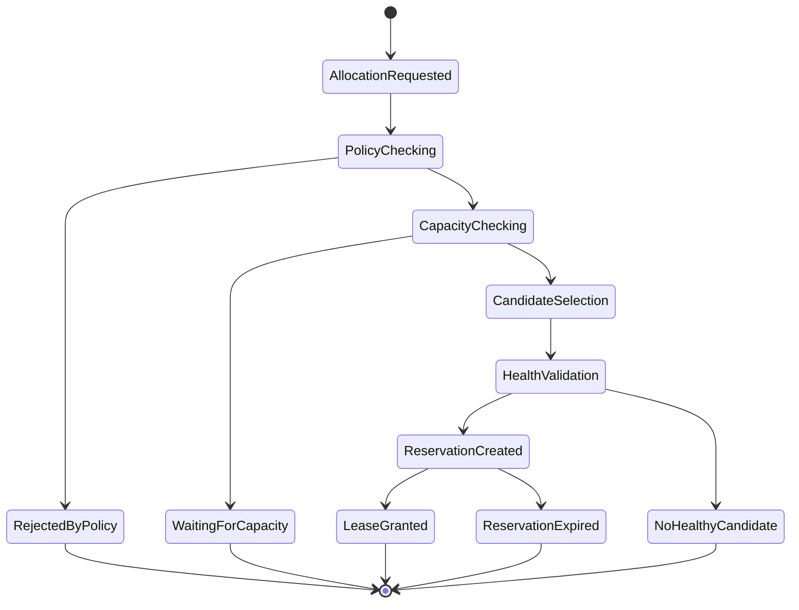

## Allocation steps

1. Receive allocation request.
2. Validate Workspace status.
3. Validate request idempotency.
4. Validate policy and quotas.
5. Determine required resource categories.
6. Query capacity view.
7. Select compatible candidates.
8. Validate health and cooldown.
9. Create reservation.
10. Promote reservation to lease.
11. Emit ResourceLeaseGranted or equivalent rejection event.

Decision: capacity checking happens before candidate selection to reduce lock contention and unnecessary provider calls.

## Release lifecycle

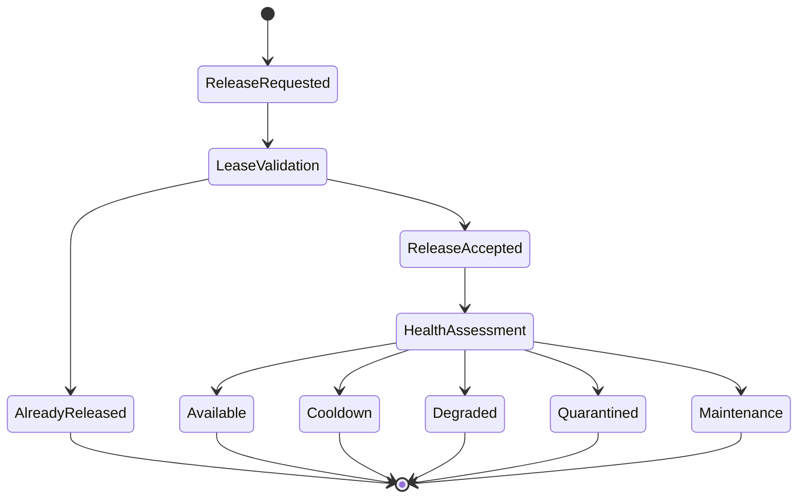

## Release rules

- Release must be idempotent.
- Release must preserve the final reason.
- Release must not erase lease history.
- Release must evaluate health before returning resource to availability.
- Release must emit event even when it is a duplicate release attempt.
- Release must never move a blocked resource to available without recovery policy.

## Reservation lifecycle

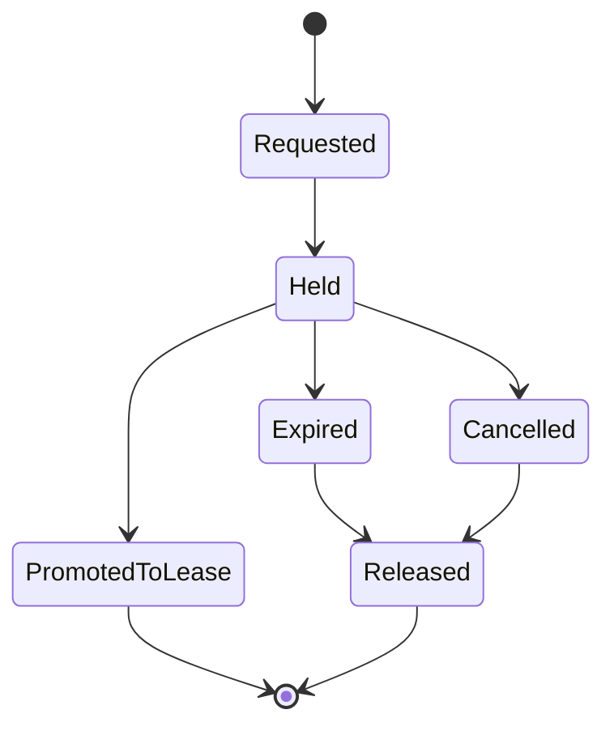

## Reservation rules

- A reservation is short lived.
- A reservation blocks incompatible allocation.
- A reservation must expire automatically.
- A reservation can be promoted to lease once all allocation conditions are satisfied.
- A reservation is not permission to use the resource.
- A reservation must be tied to Workspace and actor or Execution.

## Resource state transitions

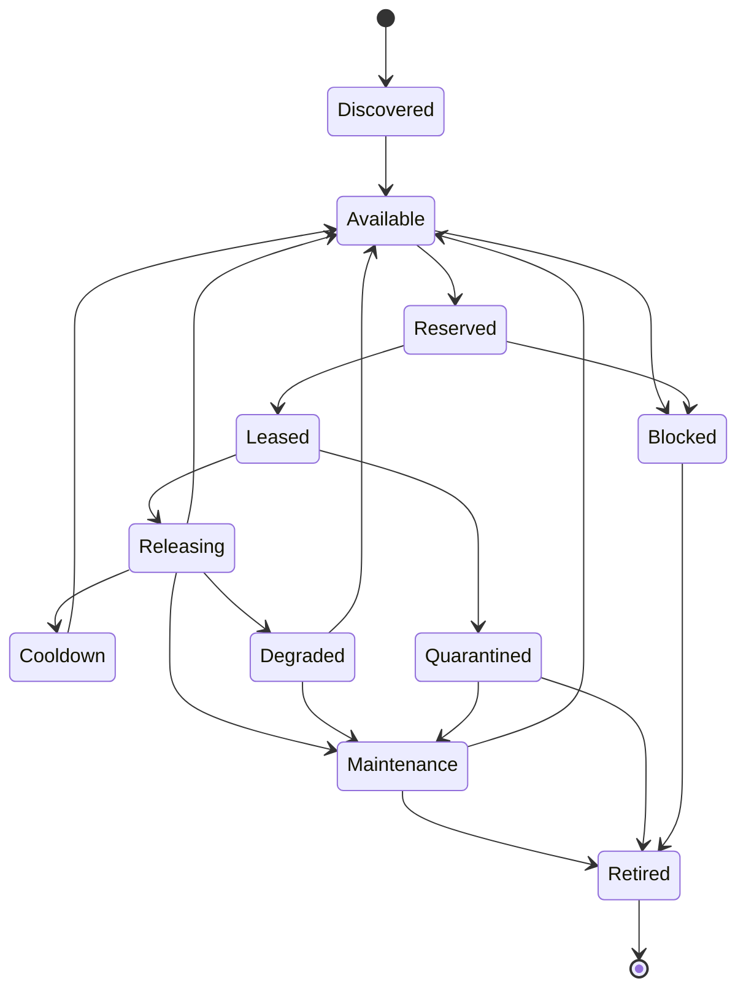

## State definitions

### Discovered

Resource exists in a provider or inventory but is not eligible for use.

### Available

Resource can be considered for allocation.

### Reserved

Resource is temporarily held and not yet usable.

### Leased

Resource is assigned for bounded use.

### Releasing

Release is in progress and health is being evaluated.

### Cooldown

Resource is temporarily unavailable by policy.

### Degraded

Resource has health concerns but may recover.

### Maintenance

Resource is intentionally removed from allocation.

### Blocked

Resource is not allowed for use due to security, provider, reputation or policy risk.

### Quarantined

Resource may have unsafe or inconsistent state after failure.

### Retired

Resource is permanently removed from active use.

## Failure scenarios

### No capacity

No eligible resource exists for the Workspace and constraints.

Expected behavior:

- return waiting decision if temporary;
- reject by policy if quota or plan forbids;
- emit capacity pressure event;
- inform Scheduler for backpressure.

### Candidate becomes unavailable

A candidate passes selection but fails before lease.

Expected behavior:

- release reservation;
- mark stale candidate;
- retry selection within safe limit;
- avoid infinite selection loop.

### Lease expires during Execution

Expected behavior:

- emit lease expired event;
- notify Execution Engine;
- quarantine resource if use state is ambiguous;
- allow Execution Engine to classify failure and retry.

### Worker heartbeat lost

Expected behavior:

- wait until lease grace window;
- mark lease suspect;
- prevent new incompatible leases;
- coordinate with Execution Engine recovery;
- release or quarantine based on resource category and safety.

### Provider inconsistency

Provider reports resource as available while Resource Manager has active lease, or inverse.

Expected behavior:

- Resource Manager state is source of allocation truth;
- mark provider signal inconsistent;
- prevent new allocation until reconciled;
- emit incident-grade event if risk is high.

### Double allocation attempt

Two concurrent requests try to reserve same incompatible resource.

Expected behavior:

- only one can acquire reservation;
- losing request selects another candidate or waits;
- no partial duplicated lease.

### Policy changes during lease

Workspace policy changes while lease is active.

Expected behavior:

- existing lease continues only if policy allows grandfathering;
- otherwise request controlled cancellation or early release;
- never silently violate policy.

### Resource fails health check on release

Expected behavior:

- do not return to available;
- transition to degraded, cooldown, maintenance or quarantine;
- emit health change event;
- preserve link to Execution that last used it.

## Recovery

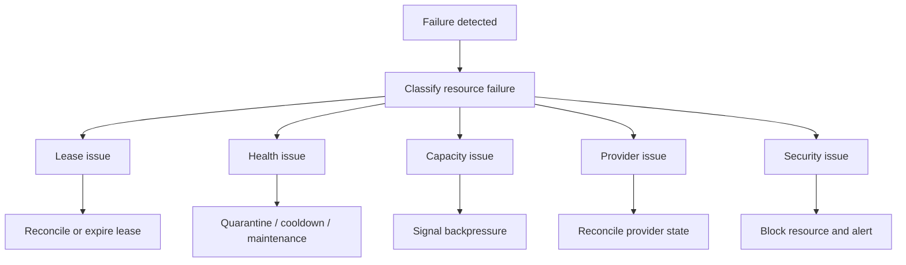

## Recovery principles

- Prefer quarantine over unsafe reuse.
- Prefer waiting over failed execution when capacity loss is temporary.
- Prefer idempotent release over manual cleanup.
- Preserve history even after recovery.
- Recovery must not create cross-Workspace leakage.
- Recovered resources must pass health and policy checks before availability.

## Observability

Resource Manager must emit a complete operational timeline.

Required event families:

- ResourceDiscovered;
- ResourceRegistered;
- ResourcePolicyEvaluated;
- ResourceCapacityChecked;
- ResourceCandidateSelected;
- ResourceReservationCreated;
- ResourceReservationExpired;
- ResourceLeaseGranted;
- ResourceLeaseRenewed;
- ResourceLeaseReleased;
- ResourceLeaseExpired;
- ResourceHealthChanged;
- ResourceCooldownStarted;
- ResourceQuarantined;
- ResourceBlocked;
- ResourceRecovered;
- ResourceRetired;
- ResourceAllocationRejected;
- ResourceAllocationWaiting;
- ResourceContentionDetected;
- ResourceDeadlockPrevented.

## Metrics

### Capacity metrics

- available resources by category;
- leased resources by category;
- reserved resources by category;
- resources in cooldown;
- resources degraded;
- resources blocked;
- resource utilization by Workspace;
- resource utilization by category;
- capacity pressure score.

### Allocation metrics

- allocation requests total;
- allocation success rate;
- allocation wait rate;
- allocation rejection rate;
- average allocation latency;
- candidate selection attempts;
- contention rate;
- lease renewal rate;
- lease expiration rate.

### Reliability metrics

- health check failure rate;
- resource failure rate by category;
- provider inconsistency count;
- quarantine count;
- recovery success rate;
- duplicate release attempts;
- orphaned lease count.

### Security and isolation metrics

- cross-Workspace policy denial count;
- blocked resource attempts;
- unauthorized resource request attempts;
- sensitive resource release anomalies;
- manual review triggers.

Decision: metrics are part of the specification because Resource Manager is an operational subsystem, not a passive registry.

## Capacity management

Resource Manager must maintain capacity views at several levels:

- global platform view;
- Workspace view;
- resource category view;
- provider view;
- isolation class view;
- health-adjusted capacity view;
- scheduled demand view.

Capacity must distinguish:

- theoretical capacity;
- available capacity;
- healthy capacity;
- allocatable capacity;
- reserved capacity;
- leased capacity;
- degraded capacity.

## Capacity data flow

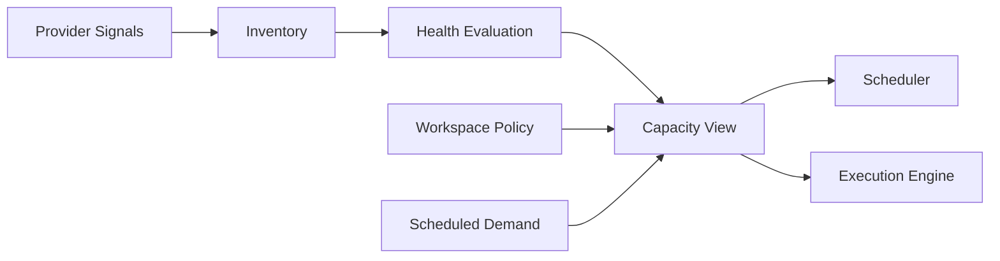

## Scaling

The Resource Manager design must support:

- 1000 concurrent Executions;
- concurrent allocation requests;
- high frequency lease renewals;
- provider health changes;
- partitioned capacity by Workspace;
- future extraction as independent service.

Scaling principles:

- partition by Workspace where possible;
- keep locks short lived;
- avoid provider calls while holding critical locks;
- cache capacity views only with clear freshness;
- use idempotency for repeated requests;
- prefer asynchronous reconciliation for provider drift;
- expose backpressure before exhaustion.

## Workspace isolation

Workspace isolation is mandatory.

Rules:

- every resource record must have Workspace ownership or explicit pool policy;
- every reservation must include Workspace;
- every lease must include Workspace;
- every capacity decision must apply Workspace limits;
- every metric must be filterable by Workspace;
- no resource can move between Workspaces without auditable transition;
- shared pools must be governed by explicit isolation policy;
- Business affinity never overrides Workspace ownership.

## Security model

### Access control

Resource Manager must distinguish:

- system-initiated lease for Execution;
- operator-initiated administrative action;
- provider-originated health signal;
- recovery process action.

Each action must be attributable.

### Secret handling

Resource Manager may reference credentials but must not expose secrets.

Credential Governance remains responsible for secret lifecycle.

### Least privilege

Consumers receive only the resource information required for their role.

Workers receive lease permission, not broad inventory access.

### Auditability

Every sensitive action must produce audit events:

- manual override;
- forced release;
- quarantine removal;
- resource reassignment;
- policy override;
- cross-Workspace pool use.

## Concurrency model

Resource Manager must assume:

- allocation requests arrive concurrently;
- Workers can crash;
- release can race with expiration;
- health checks can race with allocation;
- policy changes can race with lease renewal;
- provider state can lag behind internal state.

Concurrency principles:

- resource state transitions are serialized per resource;
- Workspace capacity changes are coordinated per Workspace and category;
- leases use explicit expiration;
- reservations are short lived;
- release is idempotent;
- renewal is conditional on current policy and resource state;
- stale commands must be rejected or treated as no-op.

## Resource locking

Locks are conceptual coordination mechanisms, not implementation mandates.

Lock scopes:

- resource-level lock for state transition;
- Workspace-category lock for quota reservation;
- lease-level lock for renewal and release;
- provider reconciliation lock for drift correction.

Lock rules:

- acquire narrowest lock possible;
- never hold lock while calling external provider;
- never hold multiple resource locks unless ordered deterministically;
- locks must have timeout;
- lock acquisition failure should produce retry or waiting, not corruption.

## Deadlock prevention

Deadlock prevention rules:

1. Use deterministic lock ordering: Workspace, resource category, resource identity, lease identity.
2. Avoid nested locks across providers.
3. Do not call provider adapters while holding allocation locks.
4. Use bounded wait times.
5. Abort and retry allocation plan if lock order cannot be satisfied.
6. Emit ResourceDeadlockPrevented when an allocation is abandoned to avoid deadlock.

## Timeout strategy

Timeout classes:

- reservation timeout;
- lease timeout;
- lease renewal timeout;
- provider response timeout;
- health check freshness timeout;
- allocation decision timeout;
- release grace timeout;
- quarantine review timeout.

Rules:

- timeouts must be explicit by resource category;
- expired reservations release capacity automatically;
- expired leases do not automatically imply safe resource reuse;
- provider timeout should degrade confidence, not always block the resource;
- repeated timeout patterns should affect health score.

## Backpressure

Resource Manager must provide backpressure signals.

Backpressure reasons:

- no healthy capacity;
- Workspace quota exhausted;
- provider degraded;
- too many pending reservations;
- lock contention high;
- lease renewal pressure high;
- health signal stale;
- recovery backlog high.

Backpressure responses:

- schedule later;
- wait for resource;
- lower priority;
- reject by policy;
- require manual review;
- reduce concurrency for Workspace or category.

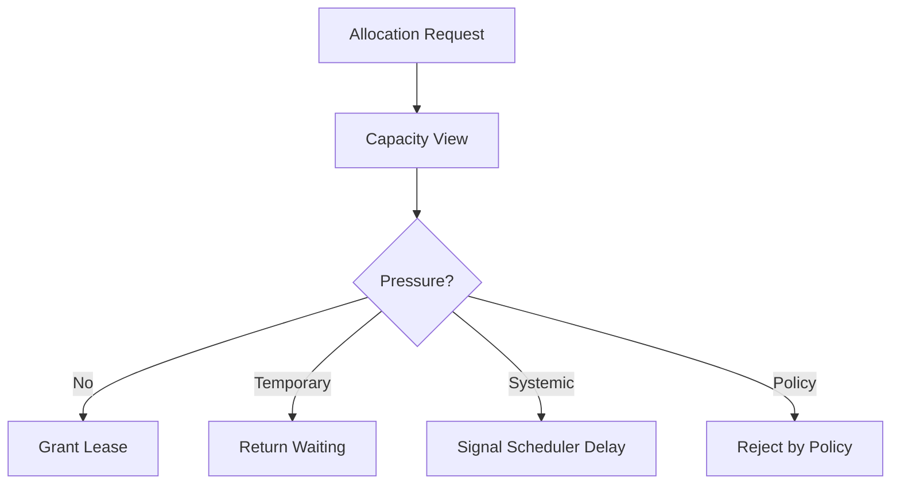

## Priority rules

Resource Manager does not own global scheduling priority, but it must respect priority signals from Execution Engine and Scheduler.

Priority inputs:

- Workspace priority tier;
- Execution priority;
- retry attempt;
- deadline;
- resource scarcity;
- operational incident status;
- manual override.

Priority constraints:

- priority cannot bypass Workspace isolation;
- priority cannot allocate blocked resources;
- priority cannot violate hard quota unless explicit override policy exists;
- priority can choose among eligible candidates;
- priority can influence waiting order.

## Component diagram

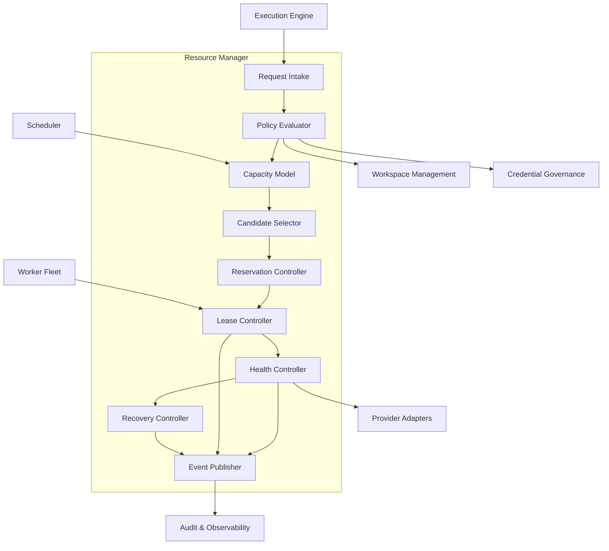

## Allocation sequence

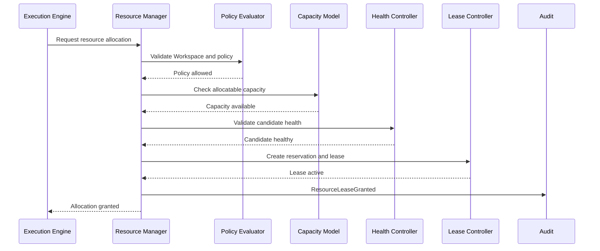

## Release sequence

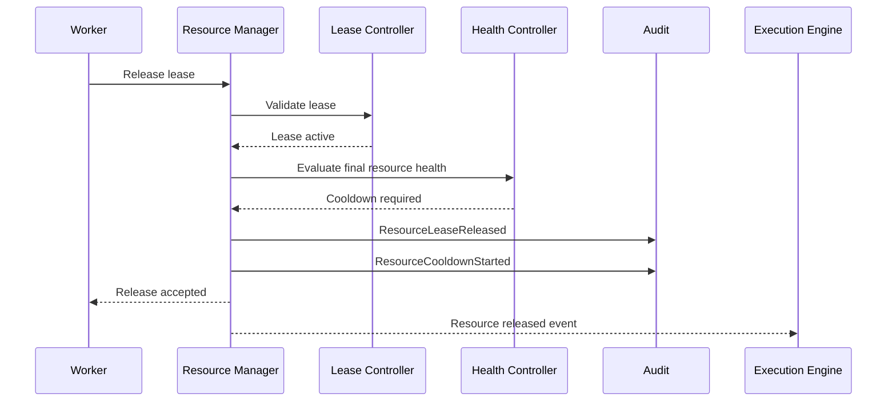

## Data flow diagram

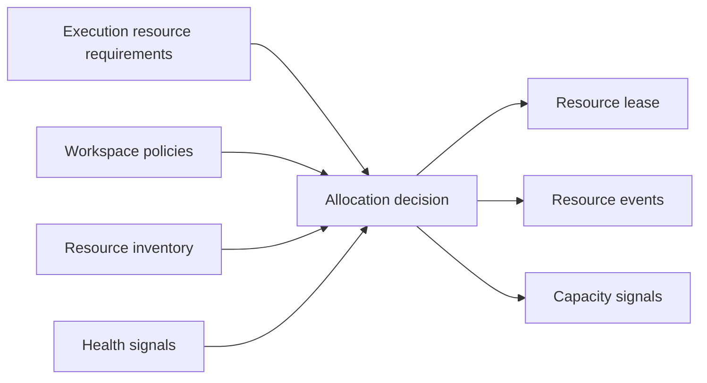

## VM-specific behavior

VM resources require:

- Workspace ownership or explicit pool eligibility;
- baseline health;
- snapshot readiness if productive;
- maintenance state awareness;
- lease exclusivity unless category supports sharing;
- quarantine after ambiguous Worker failure;
- release evaluation before reuse.

VM allocation must respect Blueprint-0004.

## Proxy-specific behavior

Proxy resources require:

- Workspace policy eligibility;
- health validation;
- cooldown control;
- isolation class;
- business affinity only as policy signal;
- reputation-aware degradation;
- rotation rules.

Proxy allocation must respect Blueprint-0005.

## AI-capacity behavior

AI capacity is a resource category even when no physical machine is assigned.

AI capacity requires:

- Workspace quota;
- provider availability;
- model or provider constraints;
- agent policy compatibility;
- budget or usage limits;
- concurrency limits;
- backpressure signals.

Decision: treating AI as a resource prevents hidden uncontrolled model usage.

## Browser and Android behavior

Browser profiles and Android devices are execution resources.

They require:

- Workspace ownership or eligibility;
- session isolation;
- health state;
- lease-based use;
- cleanup after release;
- quarantine if session state is ambiguous.

They are capabilities behind adapters, not core execution models.

## Consistency model

Strong consistency is required for:

- resource state transition;
- lease creation;
- lease release;
- incompatible allocation prevention;
- Workspace quota consumption.

Eventual consistency is acceptable for:

- provider inventory reconciliation;
- capacity reports;
- metrics aggregation;
- health score rollups;
- historical analytics.

Decision: strict consistency everywhere would reduce throughput. Strict consistency is reserved for invariants that protect isolation and correctness.

## Idempotency

Idempotency is required for:

- allocation request;
- reservation creation;
- lease promotion;
- lease renewal;
- release;
- provider reconciliation action;
- health signal processing when repeated.

Repeated commands must not create duplicate active leases.

## Manual operations

Manual operations must be rare and auditable.

Allowed conceptual operations:

- force cooldown;
- force quarantine;
- force maintenance;
- retire resource;
- recover resource after review;
- override policy with explicit reason, if governance permits.

Manual operations must never bypass Workspace isolation.

## Future extensions

- Cost-aware allocation.
- SLA-aware allocation.
- Dedicated Workspace resource pools.
- Burst capacity.
- Predictive capacity planning.
- Provider scoring.
- Resource warm pools.
- Human approval capacity as resource.
- Geo-affinity rules.
- Carbon or cost optimization.
- Cross-region resource failover.

## Open questions

- What resource categories are required for the first production milestone?
- Which resources are dedicated by default and which may be shared?
- What is the initial quota model per Workspace?
- How long should leases last by category?
- What categories require quarantine after Worker failure?
- What minimum health signal freshness is acceptable?
- What manual override roles will exist?
- What metrics are required before first production launch?
- Will AI capacity be budget-limited, concurrency-limited or both?
- How will provider cost be attributed to Workspace?

## Implementation readiness checklist

Before implementation, engineering must confirm:

- accepted resource categories for MVP;
- Workspace quota model;
- lease duration defaults;
- reservation timeout defaults;
- cooldown policy by category;
- health signal model;
- provider adapter boundaries;
- audit event schema at conceptual level;
- manual operation policy;
- recovery ownership between Execution Engine and Resource Manager.

## References

- `docs/rfc/RFC-0001-execution-engine.md`
- `docs/blueprints/Blueprint-0004-provision-virtual-machine.md`
- `docs/blueprints/Blueprint-0005-assign-residential-proxy.md`
- `docs/blueprints/Blueprint-0006-execution-lifecycle.md`
- `docs/domain/core-domain.md`
- `docs/domain/bounded-contexts.md`
- `docs/domain/aggregates.md`
- `docs/domain/domain-events.md`
- `docs/decisions/ADR-0001-monorepo-modular.md`
- `docs/decisions/ADR-0002-documentation-first.md`
- `docs/decisions/ADR-0003-clean-architecture.md`
- `docs/decisions/ADR-0005-workspace-as-first-class-domain.md`
- `docs/decisions/ADR-0006-execution-engine-as-platform-core.md`
